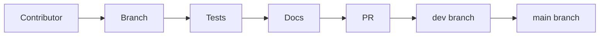
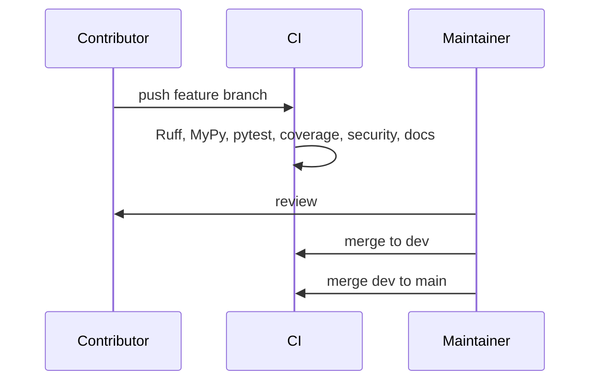

# Contributing to AgentReplay

Thank you for helping build AgentReplay. The project is intended to become a
maintainable open-source debugging platform for AI agents, so contributions
should keep the core small, typed, local-first, and framework agnostic.

## Overview

AgentReplay records agent execution data and analyzes recorded traces offline.
Contributions must preserve the design rule that replay, diff, debugger,
profiler, reporting, security scans, telemetry mapping, and regression analysis
do not call LLMs or execute tools.

## Concept

Most changes should fit one package boundary:

- `agentreplay.core`: immutable models and primitives
- `agentreplay.recording`: recorder behavior
- `agentreplay.storage`: persistence contracts and SQLite
- `agentreplay.replay`, `diff`, `debugger`, `profiler`, `reporting`,
  `regression`, `security`, `observability`, `performance`: read-only engines
- `agentreplay.adapters`: optional framework integrations
- `agentreplay.plugins`: plugin lifecycle
- `agentreplay.sdk`: public extension platform
- `agentreplay.cli`: command wrappers

## Architecture



## Workflow

1. Create a focused branch.
2. Make the smallest coherent change.
3. Add or update tests.
4. Update documentation for public behavior.
5. Run local checks.
6. Open a pull request.
7. Merge through `dev`, then `main`, after validation.

## Mermaid Diagram



## Examples

```bash
python -m pip install --upgrade pip
python -m pip install -e ".[dev]"
pre-commit install

python -m ruff format --check
python -m ruff check
python -m mypy
python -m pytest -q -m "not performance"
python -m pytest -q -m performance
```

## API

When adding public APIs:

- export intentional symbols through package `__all__`
- add type hints and docstrings
- update [API Reference](docs/api_reference.md)
- add tests that use the public import path
- avoid breaking pre-1.0 APIs without changelog notes

## CLI

When adding or changing CLI behavior:

- register commands in `agentreplay.cli.main`
- keep handlers thin
- return explicit exit codes
- add tests through `agentreplay.cli.main.main`
- update [CLI Reference](docs/CLI_REFERENCE.md)

## Branch Strategy

- `feature/<short-name>` for feature work
- `fix/<short-name>` for bug fixes
- `docs/<short-name>` for documentation-only changes
- `release/vX.Y.Z` for release preparation

Repository integration uses `feature/* -> dev -> main`.

## Code Style

- Python 3.11+
- strong typing
- Ruff formatting and linting
- MyPy strict mode
- pytest tests
- absolute package imports
- docstrings for public modules, classes, and functions
- no real secrets in tests, examples, or docs
- no required dependencies for optional integrations

## Documentation Style

Documentation must reflect the implementation. If docs and code disagree, the
code is the source of truth. Prefer:

- short sections with descriptive headings
- tables for options and capabilities
- Mermaid diagrams for flows
- runnable examples using public APIs
- explicit notes for optional extras
- links to related guides

## Best Practices

- Keep framework-specific behavior inside adapter packages.
- Use `agentreplay.sdk` for third-party extension surfaces.
- Add tests near the affected module.
- Keep storage schema changes migration-aware.
- Keep replay and analysis read-only.

## Common Mistakes

- Adding a dependency to the base install for an optional feature.
- Importing private internals from examples or plugins.
- Changing CLI output without tests.
- Updating docs from intent instead of implementation.

## Performance Notes

Large-trace behavior belongs in `agentreplay.performance` or storage streaming
APIs. Mark timing-sensitive tests with `@pytest.mark.performance`.

## Troubleshooting

If checks fail, run the focused command first, then the full gate:

```bash
python -m pytest -q tests/test_target.py
python -m ruff check path/to/file.py
python -m mypy path/to/file.py
```

## References

- [Architecture](docs/architecture.md)
- [System Design](docs/SYSTEM_DESIGN.md)
- [Development Guide](docs/development.md)
- [Release Process](RELEASE.md)
- [Security Policy](SECURITY.md)
