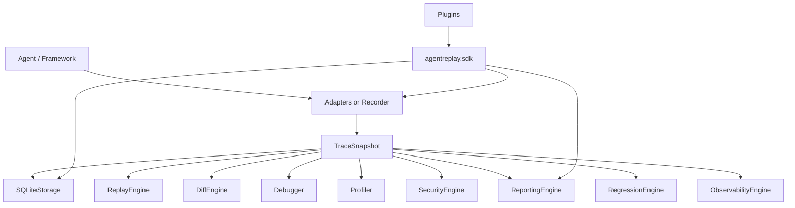
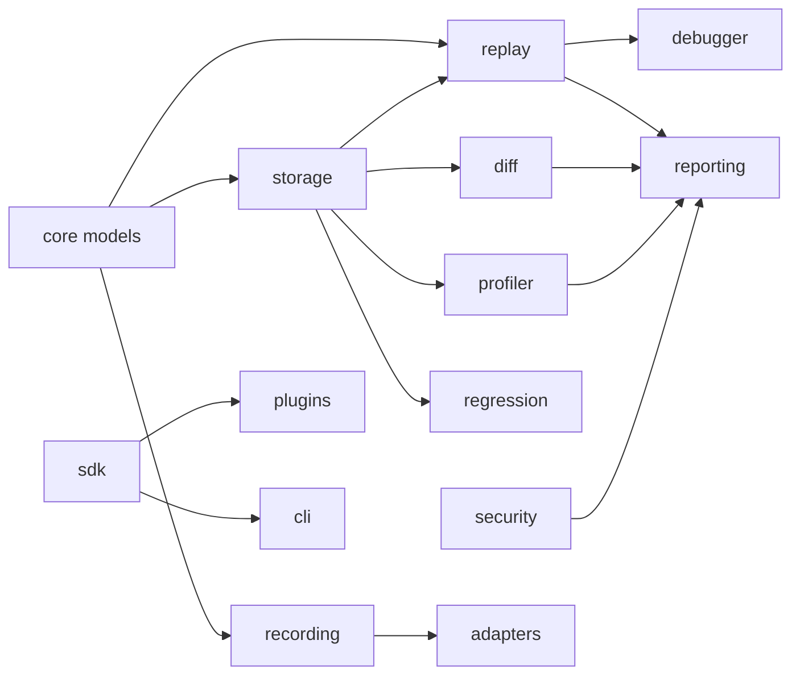
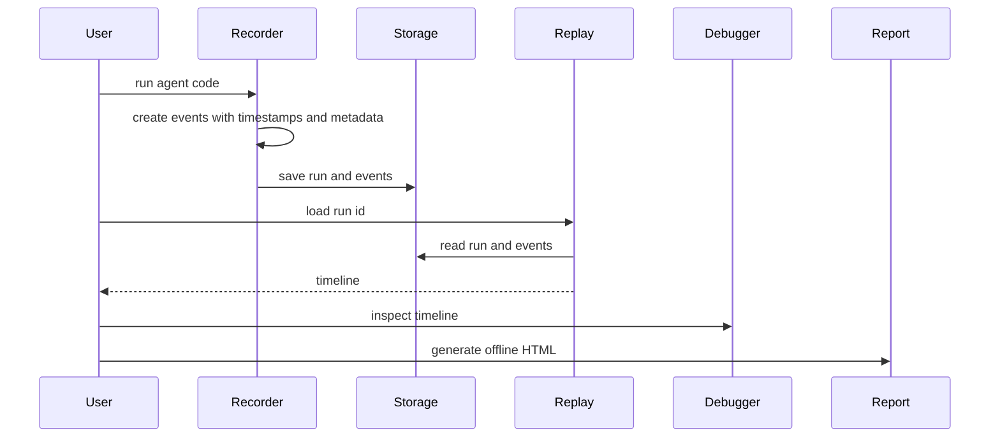
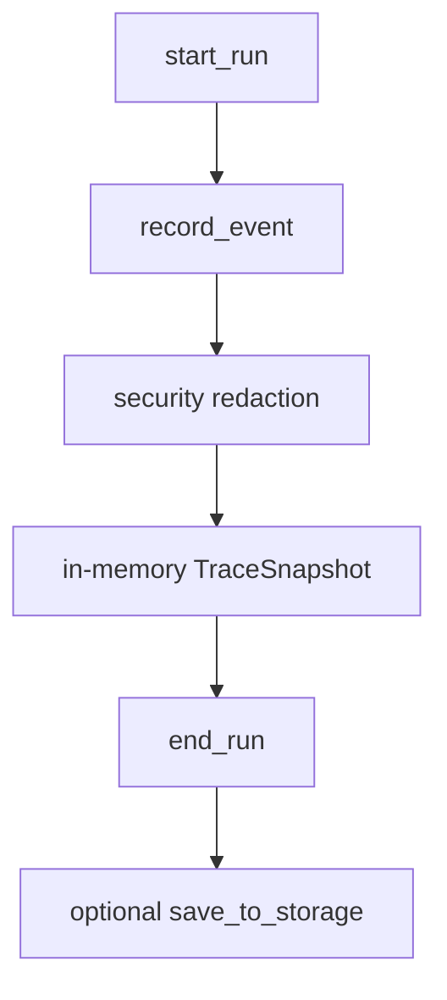
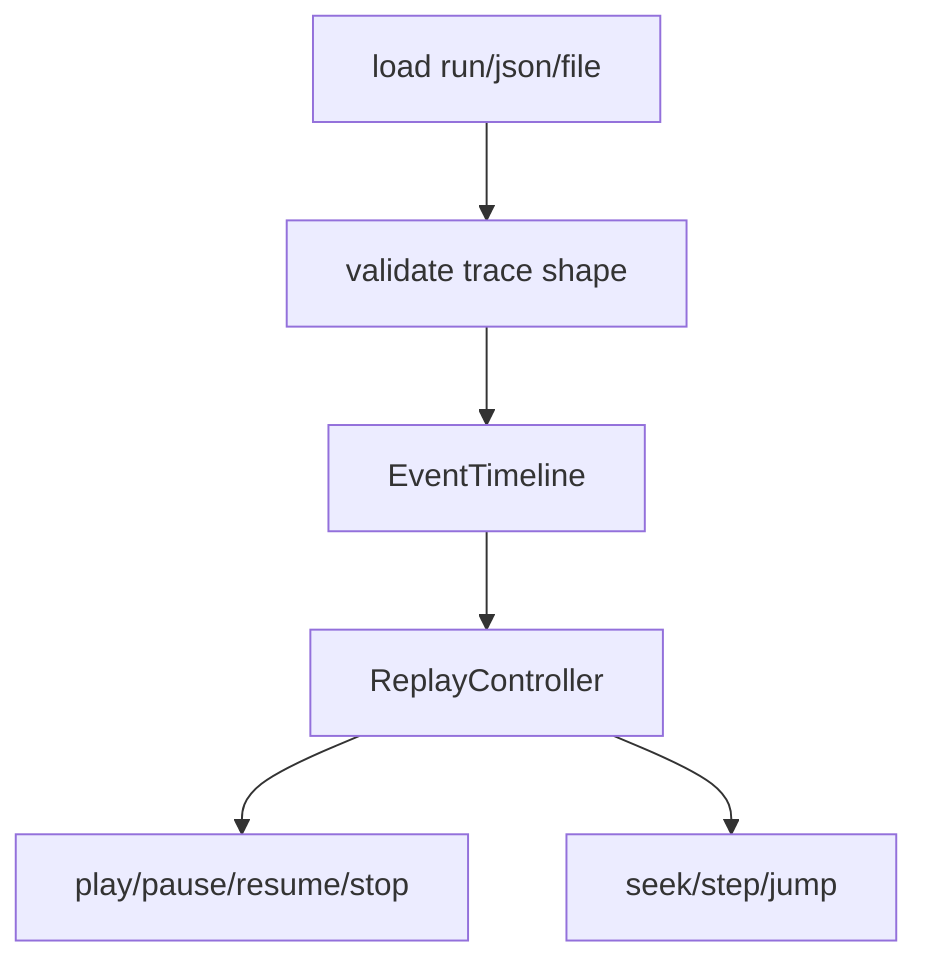
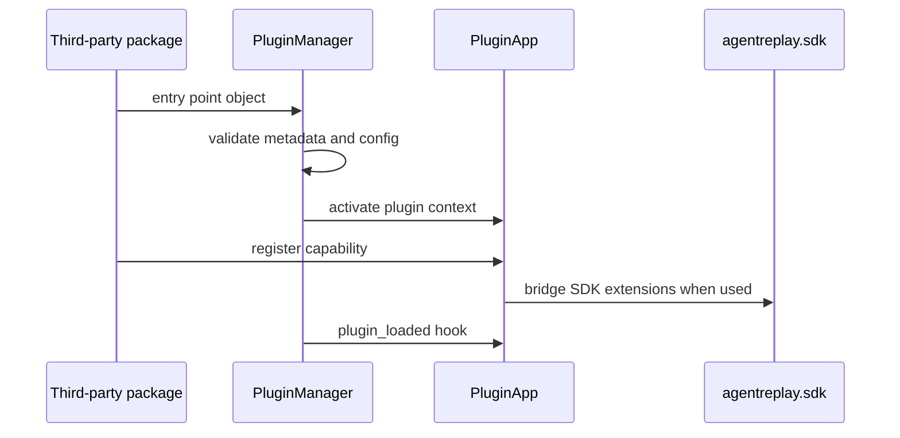
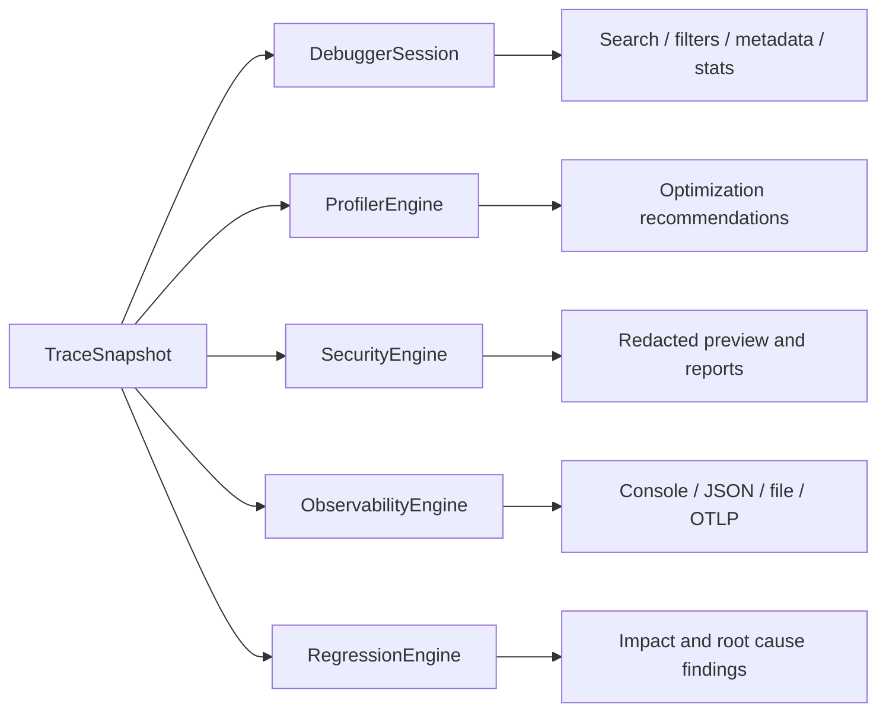

# AgentReplay

AgentReplay is a local, framework-agnostic debugging platform for AI agent
executions. It records what happened during a run, persists it locally, and lets
developers replay, inspect, compare, profile, secure, export, and report on that
run without calling an LLM or executing a tool during analysis.

```bash
pip install agentreplay
```

> **Status**
>
> AgentReplay is pre-1.0 (`0.1.0`) and feature complete for the current release
> candidate. Public APIs are typed and documented, but long-term compatibility
> is not declared stable until `1.0`.

## Problem Statement

AI agents are hard to debug because a single answer can depend on prompts,
model settings, tool calls, memory reads, retries, branch decisions, framework
callbacks, and hidden metadata. Logs usually show fragments. Traces usually
require vendor-specific infrastructure. Reproducing a failure can accidentally
call an LLM or execute a tool again.

AgentReplay solves that by recording a local execution trace and analyzing that
trace read-only.

## Why AgentReplay

- **No API key required**: the base package has no runtime dependencies and no
  cloud requirement.
- **Framework agnostic core**: OpenAI Agents SDK and LangGraph are first-class
  optional adapters; other frameworks can integrate through plugins or the SDK.
- **Read-only analysis**: replay, diff, debugger, profiler, regression, reports,
  security scans, and telemetry mapping inspect recorded data only.
- **Local SQLite by default**: runs can be saved, listed, loaded, streamed, and
  exported from a local database.
- **Extensible by design**: plugins and `agentreplay.sdk` support analyzers,
  exporters, storage factories, reports, visualizations, framework adapters,
  event subscriptions, hooks, and CLI commands.

## Installation

Base install:

```bash
pip install agentreplay
```

Optional extras:

```bash
pip install "agentreplay[debugger]"       # Textual terminal debugger
pip install "agentreplay[otel]"           # OTLP OpenTelemetry exporters
pip install "agentreplay[openai-agents]"  # OpenAI Agents SDK adapter
pip install "agentreplay[langgraph]"      # LangGraph adapter
pip install "agentreplay[all]"            # all runtime integration extras
```

Development install:

```bash
python -m pip install --upgrade pip
python -m pip install -e ".[dev]"
```

## 5-Minute Tutorial

### 1. Record a run

```python
from agentreplay import Recorder

with Recorder(name="support-agent") as recorder:
    recorder.system_prompt("Answer using the support policy.")
    recorder.user_prompt("How long do refunds take?")
    recorder.llm_request(provider_name="openai", model_name="gpt-demo")
    recorder.tool_started("lookup_policy", arguments={"topic": "refunds"})
    recorder.tool_finished("lookup_policy", result={"days": 30}, duration_ms=12.5)
    recorder.llm_response(
        response="Refunds take up to 30 days.",
        token_usage={"input_tokens": 12, "output_tokens": 9, "total_tokens": 21},
        cost={"amount": 0.01, "currency": "USD"},
        latency_ms=250.0,
    )
    recorder.assistant_response("Refunds take up to 30 days.")

trace = recorder.trace()
```

### 2. Save it to SQLite

```python
from agentreplay import SQLiteStorage

with SQLiteStorage(".agentreplay/agentreplay.sqlite") as storage:
    recorder.save_to_storage(storage)
    run_id = recorder.last_run_id()
```

### 3. Replay it without side effects

```python
from agentreplay import ReplayEngine, SQLiteStorage

with SQLiteStorage(".agentreplay/agentreplay.sqlite") as storage:
    session = ReplayEngine(storage=storage).load(run_id)

print(session.timeline.render())
```

### 4. Compare two runs

```python
from agentreplay import DiffEngine, SQLiteStorage

with SQLiteStorage(".agentreplay/agentreplay.sqlite") as storage:
    result = DiffEngine(storage=storage).compare("baseline-run", "candidate-run")

print(result.summary())
```

### 5. Generate an offline report

```python
from agentreplay import ReportingEngine, ReportOptions
from agentreplay.reporting.renderers import render_html

bundle = ReportingEngine().generate_trace(trace, options=ReportOptions(theme="dark"))
html = render_html(bundle)
```

## Architecture



### Package Dependency Graph



## Execution Flow



## Main Features

| Area | Implemented capability |
| --- | --- |
| Recording | Context manager, decorator, manual API, nested events, sync/async support, exception timing, metadata, token/cost/latency events |
| Storage | SQLite backend, repositories, transactions, schema versioning, filtering, sorting, pagination, bulk insert, streaming reads |
| Replay | Load by run id, JSON, or file; timeline rendering; play, pause, resume, stop, seek, step forward/backward, speed control |
| Diff | Added, removed, modified, unchanged events; metadata, prompt, response, model, tool, memory, retry, error, cost, token, graph, and timeline comparisons |
| Debugger | Textual TUI, execution tree, search, filters, timeline windowing, metadata panel, event export, statistics, current-event diff |
| Profiler | Duration, token, cost, model, tool, memory, retry, bottleneck, visualization, and recommendation data |
| Reporting | Self-contained offline HTML, JSON bundle, Markdown summary, ZIP package, search index, graph, timeline, profiler/security/diff sections |
| Security | Built-in secret and PII rules, field redaction, allowlist, denylist, ignore rules, custom regex rules, multiple redaction strategies |
| Observability | OpenTelemetry-compatible trace mapping, console/JSON/file/OTLP exporters, sampling, correlation context, metrics aggregation |
| Regression | Baseline-vs-target regression report, metrics, impact, root-cause hints, recommendations, trend and visualization data |
| SDK | Stable extension facade for analyzers, exporters, storage, visualization, framework adapters, reports, hooks, event bus, CLI commands |
| Plugins | Discovery, validation, dependency resolution, lifecycle hooks, registry, enable/disable, CLI management |

## CLI Examples

```bash
agentreplay --help
agentreplay version
agentreplay list --db-path .agentreplay/agentreplay.sqlite
agentreplay replay RUN_ID --timeline
agentreplay debug RUN_ID --db-path .agentreplay/agentreplay.sqlite
agentreplay diff BASELINE TARGET --summary
agentreplay inspect latest --json
agentreplay export RUN_ID --markdown --output run.md
agentreplay profile RUN_ID --html
agentreplay report RUN_ID --output report.html --compress
agentreplay regression BASELINE TARGET --markdown
agentreplay security scan RUN_ID --verbose
agentreplay telemetry export RUN_ID --request-id req-123
agentreplay benchmark --events 10000 --chunk-size 1000
agentreplay optimize --db-path .agentreplay/agentreplay.sqlite
agentreplay plugins list
```

## Framework Support

| Framework | Status | Install extra | Entry point |
| --- | --- | --- | --- |
| OpenAI Agents SDK | First-class optional adapter | `agentreplay[openai-agents]` | `agentreplay.instrument()`, `AgentReplay().attach(agent)`, `@record_agent` |
| LangGraph | First-class optional adapter | `agentreplay[langgraph]` | `from agentreplay.langgraph import instrument` |
| CrewAI | Plugin extension target | external package | `agentreplay.plugins` |
| Google ADK | Plugin extension target | external package | `agentreplay.plugins` |
| AutoGen | Plugin extension target | external package | `agentreplay.plugins` |
| SmolAgents | Plugin extension target | external package | `agentreplay.plugins` |
| PydanticAI | Plugin extension target | external package | `agentreplay.plugins` |

## Configuration

AgentReplay loads settings from explicit Python overrides, environment
variables, `agentreplay.toml`, `.agentreplay.toml`, and defaults.

```toml
enabled = true
db_path = ".agentreplay/agentreplay.sqlite"
redaction_enabled = true
log_level = "INFO"
storage_backend = "sqlite"
fail_mode = "fail_open"

[security]
enabled = true
pii_enabled = true
strategy = "placeholder"
allowlist = []
denylist = []
ignore_rules = []

[observability]
enabled = false
exporter = "console"
service_name = "agentreplay"
sampling = "always_on"
sampling_ratio = 1.0

[plugins]
enabled = true
auto_discover = true
disabled = []
```

Common environment variables:

| Variable | Purpose |
| --- | --- |
| `AGENTREPLAY_ENABLED` | Enable default recording behavior in configured integrations |
| `AGENTREPLAY_DB_PATH` | SQLite database path |
| `AGENTREPLAY_REDACTION_ENABLED` | Enable trace redaction |
| `AGENTREPLAY_SECURITY_ENABLED` | Enable security scanning and redaction settings |
| `AGENTREPLAY_OBSERVABILITY_ENABLED` | Enable telemetry export |
| `AGENTREPLAY_OBSERVABILITY_EXPORTER` | `console`, `json`, `file`, `otlp_http`, or `otlp_grpc` |
| `AGENTREPLAY_LOG_LEVEL` | `DEBUG`, `INFO`, `WARNING`, `ERROR`, or `CRITICAL` |
| `AGENTREPLAY_PLUGINS_ENABLED` | Enable plugin loading |
| `AGENTREPLAY_PLUGIN_AUTO_DISCOVER` | Enable entry-point discovery |

## Recorder Flow



## Replay Flow



## Plugin and SDK Flow



## Debugger, Profiler, Security, Observability, Regression



## Performance and Benchmarks

AgentReplay includes performance primitives for large traces:

- `TraceWindowReader` for bounded event windows
- `partial_replay` for visible replay slices
- `StreamingTraceExporter` for JSON/JSONL export without materializing all
  output in memory
- `compress_bytes`, `decompress_bytes`, and `CompressedWriter`
- `TraceSearchEngine` and `BackgroundIndexer`
- `SQLiteOptimizer` and `optimize_sqlite`
- `BenchmarkSuite` and `BenchmarkCase`

```bash
agentreplay benchmark --events 50000 --chunk-size 5000
agentreplay analyze-db --db-path .agentreplay/agentreplay.sqlite --json
agentreplay optimize --db-path .agentreplay/agentreplay.sqlite
agentreplay vacuum --db-path .agentreplay/agentreplay.sqlite
```

## Screenshots and Visuals

AgentReplay does not ship binary screenshots in the repository. The debugger and
reporting experiences are deterministic and can be captured from:

- `agentreplay debug RUN_ID`
- `agentreplay report RUN_ID --output report.html`

The HTML report is self-contained and includes the execution timeline, graph,
profiler cards, security findings, metadata, and optional diff section.

## Roadmap

Current implementation:

- In-memory recorder
- SQLite storage
- Replay, diff, debugger, profiler, reporting, security, observability,
  performance, regression, plugin SDK, and public SDK
- OpenAI Agents SDK and LangGraph adapters

Planned after `0.1.x`:

- Stabilize the `1.0` public API contract
- Add more first-party framework adapters as optional extras
- Add additional storage backends through SDK examples
- Improve deep UI test coverage for the Textual debugger and HTML report
- Publish official plugin templates

## Documentation

Start here:

- [Documentation home](docs/index.md)
- [Architecture](docs/architecture.md)
- [System design](docs/SYSTEM_DESIGN.md)
- [CLI reference](docs/CLI_REFERENCE.md)
- [API reference](docs/api_reference.md)
- [Configuration guide](docs/CONFIGURATION_GUIDE.md)
- [SDK guide](docs/SDK_GUIDE.md)
- [Plugin guide](docs/PLUGIN_GUIDE.md)
- [Troubleshooting](docs/TROUBLESHOOTING.md)

## FAQ

**Does AgentReplay call my LLM during replay?**
No. Replay reconstructs recorded events only.

**Does the base install require OpenAI, LangGraph, Textual, or OpenTelemetry?**
No. Those integrations are optional extras.

**Can I store traces somewhere other than SQLite?**
SQLite is the implemented backend. The SDK and storage protocol are designed for
additional backends.

**Can plugins crash the core runtime?**
Plugin and hook failures are isolated where possible and recorded as failures,
with fail-open behavior by default.

## Contributing

See [CONTRIBUTING.md](CONTRIBUTING.md). Run these before opening a pull request:

```bash
python -m ruff format --check
python -m ruff check
python -m mypy
python -m pytest -q -m "not performance"
python -m pytest -q -m performance
python -m pytest -q -m "not performance" --cov=agentreplay --cov-report=term
```

## License

AgentReplay is released under the [MIT License](LICENSE).
