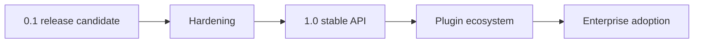
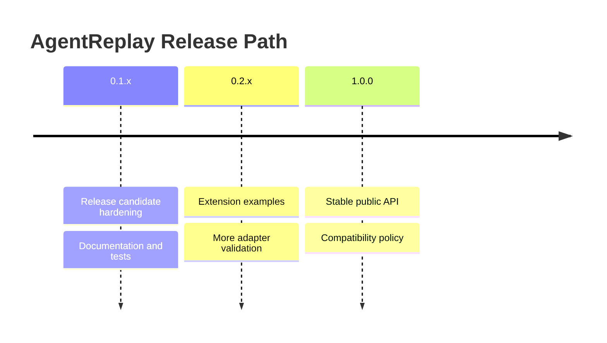

# AgentReplay Roadmap

## Overview

This roadmap reflects the current implementation and the likely path to a
stable `1.0` release. It is not a promise of dates.

## Concept

AgentReplay is already broad: recorder, SQLite storage, replay, diff, debugger,
profiler, reporting, security, observability, performance, regression, plugins,
SDK, OpenAI Agents SDK adapter, and LangGraph adapter are implemented. The next
phase is hardening, compatibility, and ecosystem growth.

## Architecture



## Workflow

1. Stabilize public APIs.
2. Improve coverage in optional adapters and UI branches.
3. Publish docs and release artifacts.
4. Add plugin templates and backend examples.
5. Review compatibility and migration policy before `1.0`.

## Mermaid Diagram



## Examples

Current production-style command set:

```bash
agentreplay replay RUN_ID
agentreplay diff BASELINE TARGET
agentreplay profile RUN_ID
agentreplay report RUN_ID --output report.html
agentreplay regression BASELINE TARGET --summary
```

## API

Pre-1.0 APIs are typed and documented. The long-term extension surface is
`agentreplay.sdk`.

## CLI

CLI compatibility should be treated as user-facing. Changes require tests and
changelog notes.

## Milestones

| Milestone | Focus |
| --- | --- |
| `0.1.x` | Release candidate, docs, CI, tests, packaging validation |
| `0.2.x` | More plugin examples, adapter compatibility hardening |
| `0.3.x` | Storage backend extension examples and large-trace polish |
| `1.0.0` | Stable public API and migration policy |

## Best Practices

- Prefer quality over breadth before `1.0`.
- Keep optional integrations optional.
- Avoid API churn in the SDK.
- Add migration notes for stored data shape changes.

## Common Mistakes

- Treating future adapter extension targets as complete integrations.
- Adding new features without tests and docs.
- Expanding dependencies in the base package.

## Performance Notes

Before `1.0`, benchmark large traces regularly across storage, replay, diff,
reporting, profiler, debugger, observability, security, regression, and export.

## Troubleshooting

If roadmap and implementation differ, inspect the code and tests first. The
implementation is the source of truth.

## References

- [README](README.md)
- [Architecture](docs/architecture.md)
- [Release Process](RELEASE.md)
