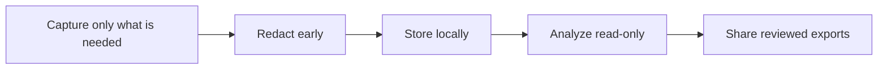
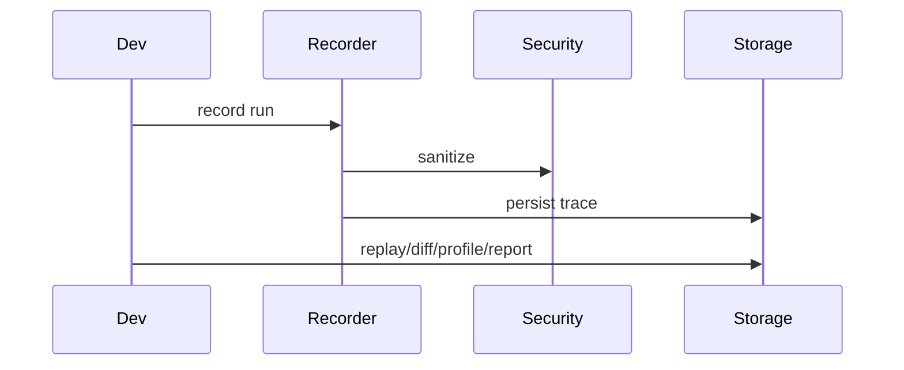

# Best Practices

## Overview

These practices keep AgentReplay deployments local, safe, maintainable, and
extension-friendly.

## Concept

AgentReplay records potentially sensitive execution data. Treat traces as
operational artifacts, not generic logs.

## Architecture



## Workflow

1. Configure redaction and storage path.
2. Record realistic events with metadata.
3. Persist traces in SQLite.
4. Analyze read-only.
5. Export only reviewed artifacts.

## Mermaid Diagram



## Examples

```bash
AGENTREPLAY_DB_PATH=.agentreplay/agentreplay.sqlite
AGENTREPLAY_SECURITY_ENABLED=true
AGENTREPLAY_REDACTION_ENABLED=true
```

## API

Prefer:

- `Recorder` for manual instrumentation
- adapter extras for framework instrumentation
- `SQLiteStorage` for local persistence
- `agentreplay.sdk` for extensions

## CLI

Use:

```bash
agentreplay security scan latest --verbose
agentreplay report latest --compress --output report.html
agentreplay diff BASELINE TARGET --summary
```

## Best Practices

- Keep `.agentreplay/` ignored.
- Record run names and tags that help future debugging.
- Use explicit run ids in CI.
- Keep plugins trusted and pinned.
- Run all quality gates before publishing.

## Common Mistakes

- Committing local SQLite databases.
- Publishing report HTML without security review.
- Installing all optional extras in minimal production images.
- Adding adapter logic to core modules.

## Performance Notes

Large traces need windowing, streaming export, and visualization limits. Do not
use full HTML reports as the only large-run debugging surface.

## Troubleshooting

When behavior is confusing, start with `list`, then `inspect`, then `replay`,
then specialized tools such as `diff`, `profile`, or `debug`.

## References

- [Security Guide](SECURITY_GUIDE.md)
- [Performance Guide](PERFORMANCE_GUIDE.md)
- [Troubleshooting](TROUBLESHOOTING.md)
