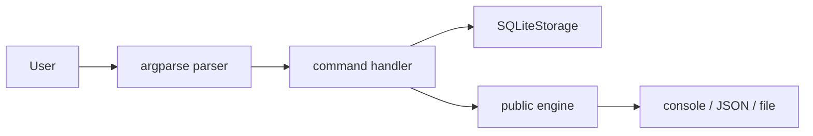
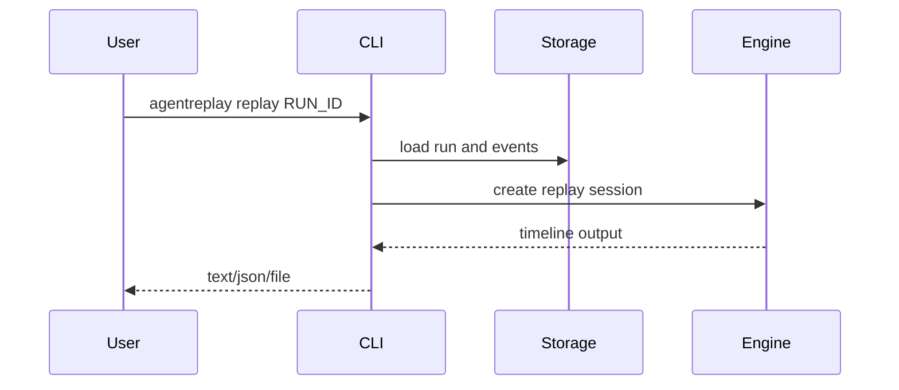

# CLI Reference

## Overview

The `agentreplay` command exposes storage inspection, replay, debugging, diff,
export, profiling, reporting, security, telemetry, performance, version, and
plugin operations.

## Concept

CLI commands are thin wrappers around public engines. They do not call LLMs or
execute tools during offline analysis.

## Architecture



## Workflow

1. Choose a run id or `latest`.
2. Pass `--db-path` when not using the default database.
3. Choose output options such as `--json`, `--markdown`, `--html`, `--summary`,
   or `--output`.
4. Use `--verbose` on the root command for debug logging.

## Mermaid Diagram



## Examples

```bash
agentreplay --help
agentreplay --version
agentreplay version
agentreplay list --db-path .agentreplay/agentreplay.sqlite --limit 20
agentreplay inspect latest --json
agentreplay replay RUN_ID --timeline --speed 1
agentreplay replay --file exported-run.json --step
agentreplay debug RUN_ID --diff-run OTHER_RUN
agentreplay diff BASELINE TARGET --markdown --verbose
agentreplay export RUN_ID --html --output run.html
agentreplay profile RUN_ID --summary
agentreplay report RUN_ID --output report.html --compress
agentreplay regression BASELINE TARGET --graph
agentreplay security scan RUN_ID --verbose
agentreplay telemetry config --json
agentreplay telemetry export RUN_ID --request-id req-1
agentreplay plugins list
agentreplay benchmark --events 10000 --chunk-size 1000
agentreplay optimize --db-path .agentreplay/agentreplay.sqlite
agentreplay analyze-db --json
agentreplay vacuum --json
```

## API

Command registration lives in `agentreplay.cli.main.build_parser`. SDK CLI
commands are registered through `agentreplay.sdk.register_sdk_cli_commands`.

## CLI

| Command | Purpose | Common options |
| --- | --- | --- |
| `version` | Print version | none |
| `list` | List recorded runs | `--db-path`, `--limit` |
| `record` | Placeholder command for recording workflows | optional name |
| `replay` | Replay a run or file | `--file`, `--speed`, `--json`, `--timeline`, `--step`, `--from`, `--to`, `--db-path` |
| `debug` | Open Textual debugger | `--file`, `--db-path`, `--diff-run` |
| `diff` | Compare runs | `--json`, `--html`, `--markdown`, `--summary`, `--verbose`, `--db-path` |
| `inspect` | Inspect one run | `--json`, `--db-path` |
| `export` | Export a run | `--output`, `--json`, `--markdown`, `--html`, `--db-path` |
| `plugins` | Manage plugins | `list`, `info`, `install`, `disable` |
| `profile` | Profile a run | `--summary`, `--timeline`, `--json`, `--html`, `--markdown`, `--csv`, `--db-path` |
| `report` | Generate HTML report | `--html`, `--dark`, `--light`, `--output`, `--compress`, `--compare`, `--db-path` |
| `security` | Scan/verify/report/rules | `scan`, `verify`, `report`, `rules` |
| `telemetry` | Telemetry status/test/export/config | `--json`, correlation ids, `--db-path` |
| `benchmark` | Synthetic benchmark | `--events`, `--chunk-size`, `--json`, `--db-path` |
| `optimize` | Analyze SQLite indexes | `--db-path`, `--json` |
| `analyze-db` | SQLite performance report | `--json` |
| `vacuum` | Vacuum SQLite database | `--db-path`, `--json` |

## Best Practices

- Use `latest` for local debugging, explicit run ids for automation.
- Use JSON output in CI jobs.
- Write HTML and Markdown output to files when sharing reports.
- Keep `.agentreplay/` out of source control.

## Common Mistakes

- Running `debug` without installing `agentreplay[debugger]`.
- Forgetting `--db-path` when the run is in a non-default database.
- Expecting `record` to run arbitrary agents; production recording is through
  Python APIs and adapters.

## Performance Notes

Large traces should use `replay --timeline`, `report --compress`, and streaming
exports. Run performance tests separately from coverage instrumentation.

## Troubleshooting

Use `agentreplay list --db-path PATH` first. If the run appears there, use
`agentreplay inspect RUN_ID --json` to confirm the event count.

## References

- [Storage Guide](STORAGE_GUIDE.md)
- [Debugger Guide](DEBUGGER_GUIDE.md)
- [Reporting Guide](REPORTING_GUIDE.md)
