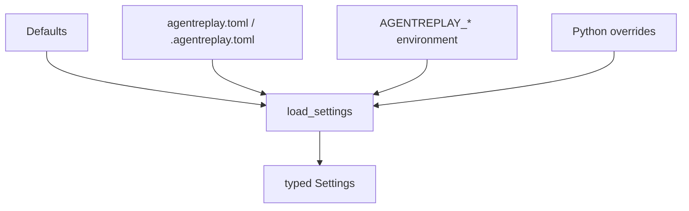
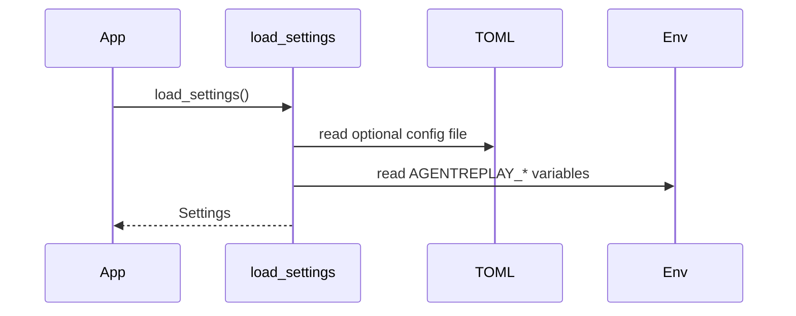

# Configuration Guide

## Overview

AgentReplay configuration is typed by `agentreplay.config.Settings`. Settings
can be loaded from defaults, TOML files, environment variables, and explicit
Python overrides.

## Concept

Configuration controls recording enablement, database path, redaction, security,
observability, logging, storage backend name, fail mode, plugin discovery,
disabled plugins, and plugin-specific config.

## Architecture



## Workflow

1. Create `agentreplay.toml` or `.agentreplay.toml` in the project.
2. Override in CI with `AGENTREPLAY_*` variables.
3. Override in code with `configure(...)` when needed.
4. Pass settings-derived configs to subsystems when using lower-level APIs.

## Mermaid Diagram



## Examples

```toml
enabled = true
db_path = ".agentreplay/agentreplay.sqlite"
redaction_enabled = true
log_level = "INFO"
storage_backend = "sqlite"
fail_mode = "fail_open"

[security]
enabled = true
pii_enabled = true
strategy = "placeholder"
allowlist = ["public_note"]
denylist = ["authorization"]
ignore_rules = []

[observability]
enabled = false
exporter = "console"
service_name = "agentreplay"
sampling = "always_on"
sampling_ratio = 1.0

[plugins]
enabled = true
auto_discover = true
disabled = []
```

```python
from agentreplay import configure, get_settings

configure(log_level="INFO", db_path=".agentreplay/agentreplay.sqlite")
settings = get_settings()
```

## API

| API | Purpose |
| --- | --- |
| `load_settings(config_path=None, environ=None, overrides=None)` | Build settings without mutating global state |
| `configure(...)` | Set process-global AgentReplay settings |
| `get_settings()` | Return active settings |
| `reset_settings()` | Clear active settings |
| `security_config_from_settings(settings)` | Build `SecurityConfig` |
| `observability_config_from_settings(settings)` | Build `ObservabilityConfig` |

## CLI

Most storage-backed commands accept `--db-path`. Telemetry config can be
inspected with:

```bash
agentreplay telemetry config --json
```

## Configuration Options

| Setting | Default | Notes |
| --- | --- | --- |
| `enabled` | `false` | Global enable flag |
| `db_path` | `.agentreplay/agentreplay.sqlite` | Default SQLite path |
| `redaction_enabled` | `true` | Controls redaction pipeline |
| `security_enabled` | `true` | Enables security settings |
| `security_pii_enabled` | `true` | Include PII rules |
| `security_strategy` | `placeholder` | `placeholder`, `mask`, `partial_mask`, `hash`, `remove`, `custom` |
| `observability_enabled` | `false` | Enables telemetry export |
| `observability_exporter` | `console` | `console`, `json`, `file`, `otlp_http`, `otlp_grpc` |
| `observability_sampling` | `always_on` | `always_on`, `always_off`, `ratio`, `parent_based`, `custom` |
| `log_level` | `WARNING` | Logging verbosity |
| `storage_backend` | `sqlite` | SQLite is the implemented backend |
| `fail_mode` | `fail_open` | Failure behavior for integrations |
| `plugins_enabled` | `true` | Plugin manager enablement |
| `plugin_auto_discover` | `true` | Entry-point discovery |
| `disabled_plugins` | `()` | Plugin names to skip |
| `plugin_config` | `{}` | Plugin-specific JSON-compatible config |

## Best Practices

- Use TOML for team-shared defaults.
- Use environment variables for CI and deployment.
- Keep secrets out of config files.
- Prefer `fail_open` for observability-only instrumentation.

## Common Mistakes

- Using `AGENTREPLAY_STORAGE_PATH`; the implemented setting is
  `AGENTREPLAY_DB_PATH`.
- Setting an observability OTLP exporter without installing `agentreplay[otel]`.
- Putting non-JSON values in plugin config.

## Performance Notes

High telemetry sample rates and large report visualization limits can increase
CPU and memory use. Tune `observability_sampling_ratio` and
`ReportOptions.visualization_limit` for production traces.

## Troubleshooting

Configuration parsing raises `ConfigurationError` for invalid values. Use a
minimal config file, then add sections incrementally.

## References

- [Security Guide](SECURITY_GUIDE.md)
- [Observability Guide](OBSERVABILITY_GUIDE.md)
- [Plugin Guide](PLUGIN_GUIDE.md)
