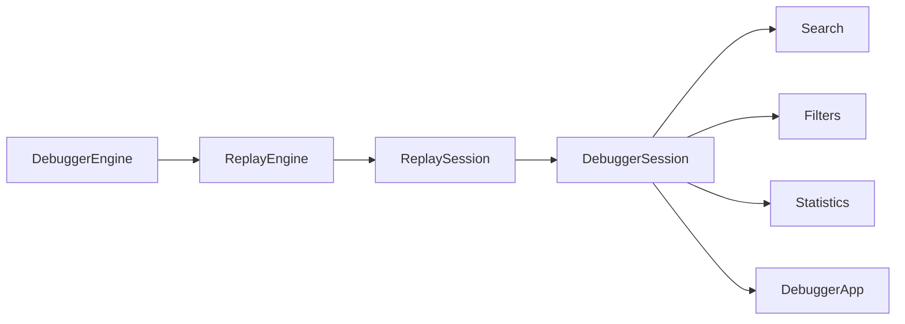
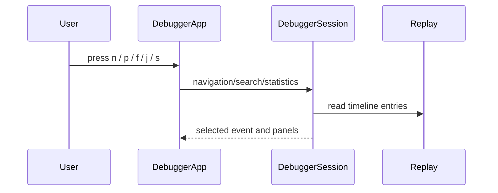

# Debugger Guide

## Overview

The debugger provides a read-only time travel view over recorded traces. It can
load traces from SQLite or exported JSON and presents an execution tree, current
event panel, metadata panel, logs, keyboard navigation, search, filters,
statistics, event export, and current-event diff support.

## Concept

Debugger state is held in `DebuggerSession`. The optional Textual UI is
implemented by `DebuggerApp` and requires `agentreplay[debugger]`.

## Architecture



## Workflow

1. Load a run id or exported file with `DebuggerEngine`.
2. Navigate through visible timeline entries.
3. Search or filter events.
4. Inspect payload and metadata.
5. Export the selected event as JSON, Markdown, or HTML.

## Mermaid Diagram



## Examples

```python
from agentreplay import DebuggerEngine
from agentreplay.debugger.models import SearchQuery

session = DebuggerEngine().load_trace(trace)
matches = session.search(SearchQuery("refund", fields=("prompt",)))
inspection = session.inspect_current()
```

## API

| API | Purpose |
| --- | --- |
| `DebuggerEngine.load(run_id)` | Load from storage |
| `DebuggerEngine.load_file(path)` | Load exported JSON |
| `DebuggerEngine.load_trace(trace)` | Load in-memory trace |
| `DebuggerSession.next_event()` / `previous_event()` | Move selection |
| `jump_to_event(event_id)` / `go_to_timestamp(timestamp)` | Jump selection |
| `search(SearchQuery)` | Search visible entries |
| `set_filter(DebuggerFilter)` | Filter visible entries |
| `inspect_current()` | Payload, metadata, parent, children |
| `statistics()` | Aggregate debugger stats |
| `render_event_export(entry, format)` | JSON, Markdown, HTML, clipboard |

## CLI

```bash
pip install "agentreplay[debugger]"
agentreplay debug RUN_ID --db-path .agentreplay/agentreplay.sqlite
agentreplay debug latest
agentreplay debug --file exported-run.json
agentreplay debug RUN_ID --diff-run BASELINE
```

## Best Practices

- Use `latest` only for local exploration.
- Use explicit run ids when debugging a reported issue.
- Export one event when sharing a focused reproduction.
- Use search fields to reduce noisy matches.

## Common Mistakes

- Running the TUI without installing the debugger extra.
- Expecting the debugger to mutate stored runs.
- Searching hidden events after an active filter removes them.

## Performance Notes

`event_window(size=...)` virtualizes visible entries. Large search and statistics
operations are linear over visible events.

## Troubleshooting

If the TUI opens but panels are empty, verify that the underlying replay session
has timeline entries with `agentreplay replay RUN_ID --timeline`.

## References

- [Replay concepts in Architecture](architecture.md)
- [CLI Reference](CLI_REFERENCE.md)
- [Reporting Guide](REPORTING_GUIDE.md)
