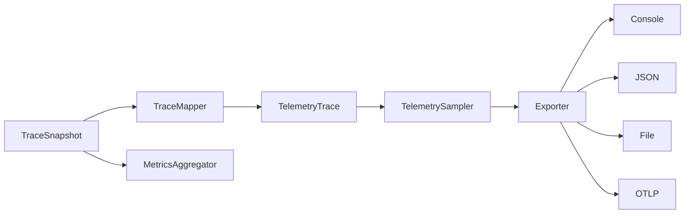
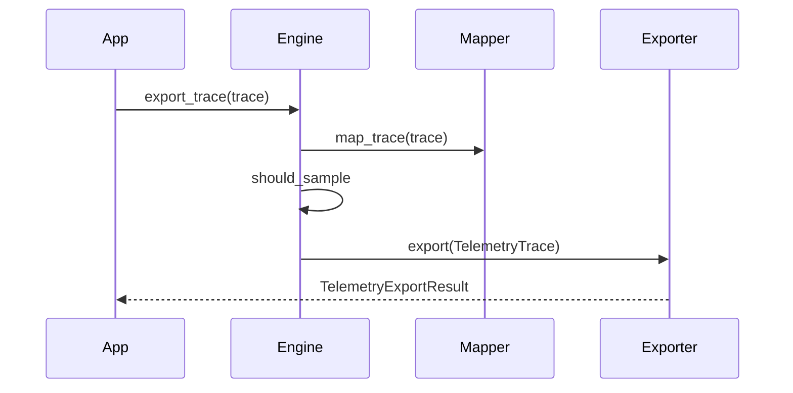

# Observability Guide

## Overview

AgentReplay maps recorded traces to OpenTelemetry-compatible telemetry.
`ObservabilityEngine` can export through console, JSON, file, OTLP HTTP, or OTLP
gRPC exporters, depending on configuration and optional extras.

## Concept

Telemetry is derived from recorded data. AgentReplay does not instrument an LLM
provider directly in this module; it maps `TraceSnapshot` and `EventRecord`
objects into `TelemetryTrace`, `TelemetrySpan`, and aggregate metrics.

## Architecture



## Workflow

1. Create `ObservabilityConfig`.
2. Map a trace with `TraceMapper` or `ObservabilityEngine.map_trace`.
3. Apply sampling.
4. Export with a configured exporter.
5. Summarize metrics for trace sets.

## Mermaid Diagram



## Examples

```python
from agentreplay import ObservabilityConfig, ObservabilityEngine

engine = ObservabilityEngine(ObservabilityConfig(enabled=True, exporter="json"))
result = engine.export_trace(trace)
```

## API

| API | Purpose |
| --- | --- |
| `ObservabilityEngine.map_trace(trace)` | Convert trace to telemetry model |
| `ObservabilityEngine.export_trace(trace)` | Map, sample, and export |
| `ObservabilityEngine.metrics(traces)` | Aggregate run metrics |
| `TraceMapper` | Low-level mapping |
| `TelemetrySampler` | Sampling decisions |
| `ConsoleTelemetryExporter`, `JSONTelemetryExporter`, `FileTelemetryExporter` | Dependency-free exporters |
| `OpenTelemetryExporter` | Optional OTLP exporter, requires `agentreplay[otel]` |

## CLI

```bash
agentreplay telemetry status
agentreplay telemetry config --json
agentreplay telemetry test --json
agentreplay telemetry export RUN_ID --request-id req-1 --session-id sess-1
```

## Best Practices

- Use JSON or file exporters locally.
- Install `agentreplay[otel]` only when OTLP export is required.
- Use sampling for high-volume production traces.
- Attach request/session/user correlation ids from the CLI or API.

## Common Mistakes

- Selecting `otlp_http` without installing OpenTelemetry packages.
- Enabling telemetry but using `always_off` sampling.
- Expecting telemetry export to record new events; it only exports existing
  traces.

## Performance Notes

Sampling happens after mapping. Large traces still incur mapping cost. Use lower
recording volume, storage windows, or custom exporters for very large runs.

## Troubleshooting

Use `agentreplay telemetry test --json` to verify local exporter configuration
before exporting real runs.

## References

- [Configuration Guide](CONFIGURATION_GUIDE.md)
- [Performance Guide](PERFORMANCE_GUIDE.md)
- [Security Guide](SECURITY_GUIDE.md)
