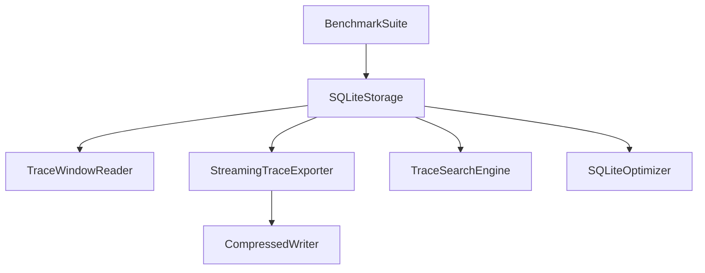
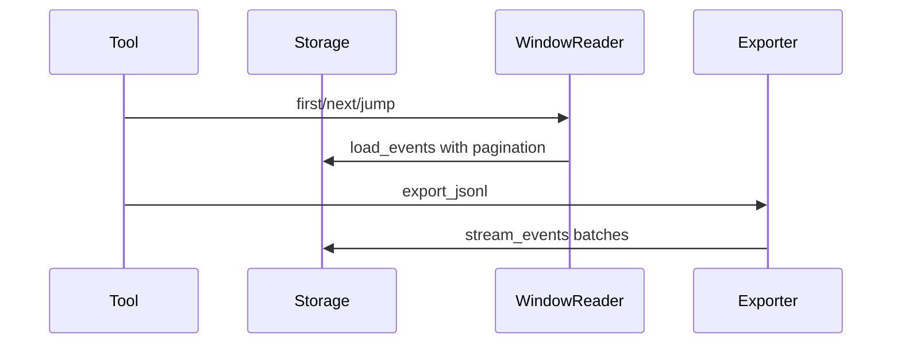

# Performance Guide

## Overview

AgentReplay includes utilities for large traces: windowed reads, partial replay,
streaming export, compression, search, indexing, SQLite optimization, and
synthetic benchmarks.

## Concept

Use in-memory APIs for small traces and streaming/windowing APIs for large
traces. Performance-sensitive tests are marked `performance` and are run
separately from coverage.

## Architecture



## Workflow

1. Store traces in SQLite.
2. Load bounded windows with `TraceWindowReader`.
3. Stream JSON or JSONL exports with `StreamingTraceExporter`.
4. Compress output when appropriate.
5. Run benchmarks for storage, replay, diff baseline scans, search, export, and
   report chunking.

## Mermaid Diagram



## Examples

```python
from agentreplay import StreamingTraceExporter, TraceWindowReader

reader = TraceWindowReader(storage, default_limit=100)
window = reader.first("run-id")

progress = StreamingTraceExporter(storage, batch_size=1000).export_jsonl(
    "run-id",
    "trace.jsonl.gz",
    compression="gzip",
)
```

## API

| API | Purpose |
| --- | --- |
| `TraceWindowReader` | Windowed event loading |
| `partial_replay` | Return a replay slice |
| `StreamingTraceExporter` | Stream JSON/JSONL |
| `compress_bytes`, `decompress_bytes`, `CompressedWriter` | Compression helpers |
| `TraceSearchEngine`, `BackgroundIndexer` | Large-trace search |
| `SQLiteOptimizer`, `optimize_sqlite` | SQLite analysis and tuning |
| `BenchmarkSuite`, `BenchmarkCase` | Synthetic benchmarks |
| `LRUCache`, `ObjectPool` | Internal utility primitives |

## CLI

```bash
agentreplay benchmark --events 50000 --chunk-size 5000 --json
agentreplay analyze-db --db-path .agentreplay/agentreplay.sqlite
agentreplay optimize --db-path .agentreplay/agentreplay.sqlite --json
agentreplay vacuum --db-path .agentreplay/agentreplay.sqlite
```

## Best Practices

- Use bulk inserts for recording persistence.
- Use streaming reads and exports for large traces.
- Limit report visualizations when event counts are high.
- Run performance tests outside coverage instrumentation.

## Common Mistakes

- Rendering full HTML reports for massive traces without a visualization limit.
- Loading all events just to find one event id.
- Benchmarking with tiny event counts and extrapolating to production.

## Performance Notes

The benchmark suite records duration, peak memory, and processed item counts for
storage insertion, first-window load, search, export, replay windowing,
diff-style linear scans, and report chunk metadata.

## Troubleshooting

If a large export is slow, lower the batch size only if memory pressure is high;
otherwise larger batches usually reduce overhead.

## References

- [Storage Guide](STORAGE_GUIDE.md)
- [Reporting Guide](REPORTING_GUIDE.md)
- [CLI Reference](CLI_REFERENCE.md)
