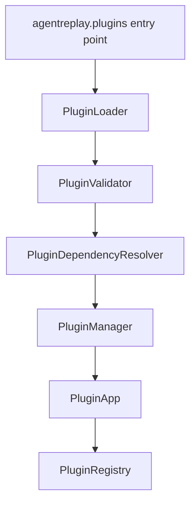
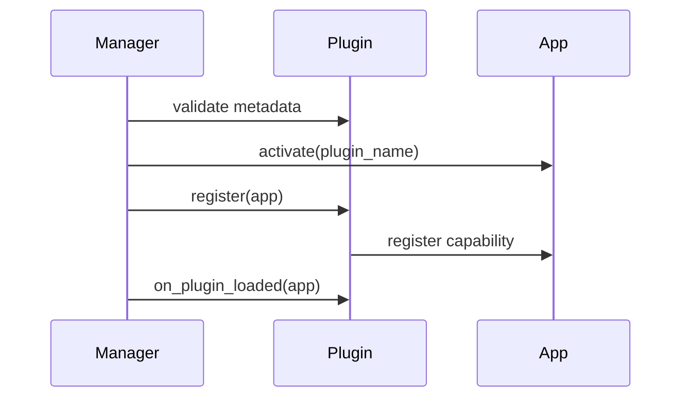

# Plugin Guide

## Overview

The Plugin SDK lets external packages register framework adapters, LLM
providers, storage backends, exporters, CLI commands, event processors, metadata
collectors, security detectors, telemetry extensions, profiler extensions,
report sections, regression extensions, and SDK extensions.

## Concept

Plugins subclass `AgentReplayPlugin`, declare metadata as class attributes, and
register capabilities through `PluginApp`. `PluginManager` handles discovery,
validation, dependency resolution, loading, unloading, and failure isolation.

## Architecture



## Workflow

1. Install a plugin package.
2. `PluginManager` discovers entry points when enabled.
3. The plugin is validated and loaded.
4. `register(app)` contributes capabilities.
5. Hooks can be emitted during lifecycle events.

## Mermaid Diagram



## Examples

```python
from agentreplay.plugins import AgentReplayPlugin


class CrewAIPlugin(AgentReplayPlugin):
    name = "crewai"
    version = "1.0.0"
    plugin_type = "agent_framework"

    def register(self, app):
        app.register_agent_framework("crewai", object())
```

## API

| API | Purpose |
| --- | --- |
| `AgentReplayPlugin` | Base plugin contract |
| `PluginApp` | Registration facade |
| `PluginManager` | Load/unload/disable and emit hooks |
| `PluginValidator` | Validate plugin metadata and config |
| `PluginDependencyResolver` | Order plugin loading |
| `PluginRegistry` | Track records |
| `PluginMetadata`, `PluginRecord`, `PluginRegistration` | Data models |

## CLI

```bash
agentreplay plugins
agentreplay plugins list
agentreplay plugins info PLUGIN_NAME
agentreplay plugins install agentreplay-crewai
agentreplay plugins disable PLUGIN_NAME
```

## Plugin Types

| Type | Registration method |
| --- | --- |
| `agent_framework` | `register_agent_framework` |
| `llm_provider` | `register_llm_provider` |
| `storage_backend` | `register_storage_backend` |
| `exporter` | `register_exporter` |
| `cli_command` | `register_cli_command` |
| `event_processor` | `register_event_processor` |
| `metadata_collector` | `register_metadata_collector` |
| `secret_detector`, `pii_detector`, `redaction_rule` | security registration methods |
| `telemetry_exporter`, `telemetry_metric`, `telemetry_span_processor`, `telemetry_attribute_enricher` | telemetry registration methods |
| `custom_profiler`, `custom_metric`, `custom_recommendation` | profiler registration methods |
| `report_section`, `report_chart`, `report_widget` | report registration methods |
| `regression_rule`, `regression_analyzer`, `regression_recommendation` | regression registration methods |
| `sdk_analyzer`, `sdk_exporter`, `sdk_storage`, `sdk_visualization`, `sdk_report` | SDK bridge registration methods |

## Hooks

`before_run`, `after_run`, `before_event`, `after_event`, `before_replay`,
`after_replay`, `before_export`, `after_export`, `plugin_loaded`, and
`plugin_unloaded` are implemented plugin hook names.

## Best Practices

- Keep plugins small and focused.
- Validate plugin-specific config.
- Prefer SDK extension wrappers for new development.
- Make optional third-party dependencies explicit in the plugin package.

## Common Mistakes

- Registering capabilities without an active plugin context.
- Using uppercase or space-containing plugin names.
- Letting plugin exceptions escape in non-critical hooks.

## Performance Notes

Plugin loading is fail-open by default. Heavy plugins should delay expensive
imports until registration or first use.

## Troubleshooting

If a plugin fails to load, inspect `agentreplay plugins list` and plugin manager
records for `failed` status and error text.

## References

- [SDK Guide](SDK_GUIDE.md)
- [Configuration Guide](CONFIGURATION_GUIDE.md)
- [CLI Reference](CLI_REFERENCE.md)
