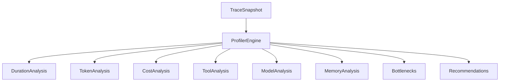
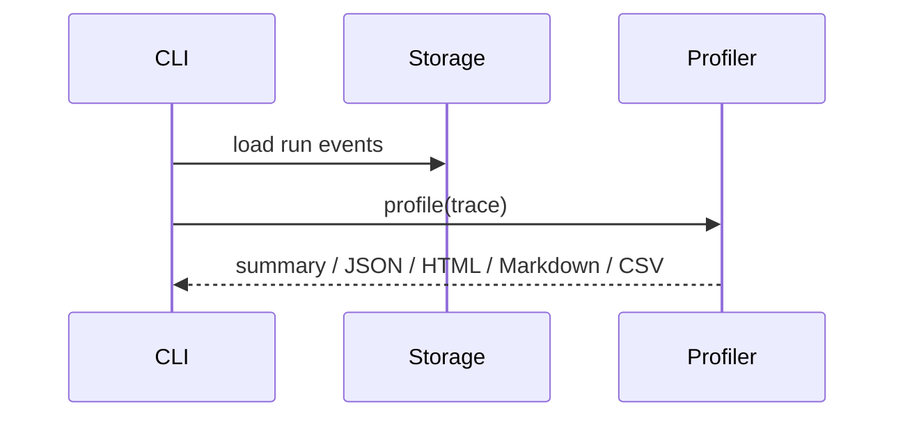

# Profiler Guide

## Overview

`ProfilerEngine` analyzes recorded traces for duration, tokens, cost, models,
tools, memory operations, retries, bottlenecks, recommendations, and
visualization-ready data.

## Concept

Profiling is deterministic and read-only. It never calls an LLM or executes a
tool; it computes metrics from recorded events.

## Architecture



## Workflow

1. Load a trace or run id.
2. Call `profile`.
3. Inspect `ProfilingReport`.
4. Render through CLI or report engine.

## Mermaid Diagram



## Examples

```python
from agentreplay import ProfilerEngine, SQLiteStorage

with SQLiteStorage(".agentreplay/agentreplay.sqlite") as storage:
    report = ProfilerEngine(storage=storage).profile("run-id")

print(report.summary())
```

## API

| Model | Purpose |
| --- | --- |
| `ProfilingReport` | Complete profile result |
| `DurationAnalysis` | Total, average, percentile, slow events |
| `TokenAnalysis` | Prompt/completion/total tokens |
| `CostAnalysis` | Total and estimated cost values |
| `ToolAnalysis` | Tool calls and distributions |
| `ModelAnalysis` | Model usage summaries |
| `MemoryAnalysis` | Memory read/write counts |
| `Bottleneck` | Identified bottleneck |
| `OptimizationRecommendation` | Suggested optimization |

## CLI

```bash
agentreplay profile RUN_ID --summary
agentreplay profile RUN_ID --timeline
agentreplay profile RUN_ID --json
agentreplay profile RUN_ID --html
agentreplay profile RUN_ID --markdown
agentreplay profile RUN_ID --csv
```

## Best Practices

- Profile the same scenario across multiple runs before optimizing.
- Compare profiler output with `DiffEngine` when behavior changes.
- Use report output for team reviews.

## Common Mistakes

- Treating cost estimates as billing truth when providers report partial data.
- Ignoring retries when investigating latency.
- Comparing runs recorded with different prompt visibility settings.

## Performance Notes

Profiler calculations iterate over recorded events. Large traces can be profiled
from storage-backed run ids, but HTML reports should limit visualization size.

## Troubleshooting

If tokens or cost are zero, confirm that events include `token_usage`, `cost`, or
their dedicated event types.

## References

- [Reporting Guide](REPORTING_GUIDE.md)
- [Regression Guide](REGRESSION_GUIDE.md)
- [Performance Guide](PERFORMANCE_GUIDE.md)
