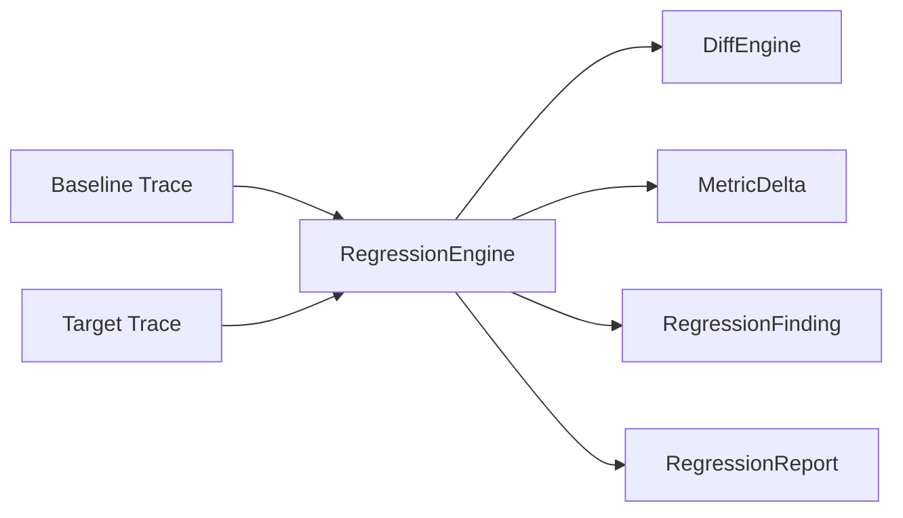
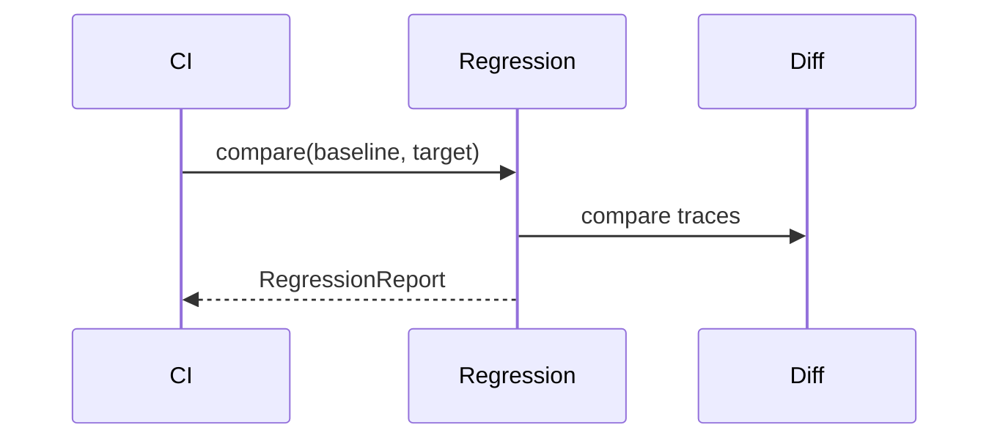

# Regression Guide

## Overview

`RegressionEngine` compares baseline and target recorded runs to identify
behavior changes, regressions, improvements, impact, root-cause hints,
recommendations, trends, and visualization-ready comparison data.

## Concept

Regression detection is stricter and more product-oriented than a raw diff. It
uses recorded data only and never executes the agent.

## Architecture



## Workflow

1. Select a baseline run and target run.
2. Compare them with `RegressionEngine`.
3. Review findings by severity and category.
4. Use reports in CI or release review.

## Mermaid Diagram



## Examples

```python
from agentreplay import RegressionEngine, SQLiteStorage

with SQLiteStorage(".agentreplay/agentreplay.sqlite") as storage:
    report = RegressionEngine(storage=storage).compare("baseline", "candidate")

print(report.summary())
```

## API

| API | Purpose |
| --- | --- |
| `RegressionEngine.compare(baseline, target)` | Generate report |
| `RegressionReport` | Complete result |
| `RegressionFinding` | One behavior change/regression/improvement |
| `MetricDelta` | Numeric comparison |
| `ImpactEstimate` | Cost/token/time/failure impact |
| `RootCause` | Deterministic root-cause explanation |
| `TrendAnalysis` | Historical trend data |
| `VisualComparison` | Visualization-ready output |

## CLI

```bash
agentreplay regression BASELINE TARGET --summary
agentreplay regression BASELINE TARGET --json
agentreplay regression BASELINE TARGET --markdown
agentreplay regression BASELINE TARGET --html
agentreplay regression BASELINE TARGET --csv
agentreplay regression BASELINE TARGET --graph
```

## Best Practices

- Compare equivalent scenarios.
- Keep model and prompt visibility settings consistent.
- Use summaries for CI, Markdown/HTML for review.
- Pair regression reports with raw diffs when investigating.

## Common Mistakes

- Treating any behavior change as a failure without reviewing severity.
- Comparing partial recordings to full recordings.
- Ignoring warning and retry changes.

## Performance Notes

The engine is designed for thousands of events and uses deterministic
comparisons. Large traces still benefit from storage-backed loading.

## Troubleshooting

If no findings appear, run `agentreplay diff BASELINE TARGET --verbose` to see
raw differences.

## References

- [CLI Reference](CLI_REFERENCE.md)
- [Profiler Guide](PROFILER_GUIDE.md)
- [Reporting Guide](REPORTING_GUIDE.md)
