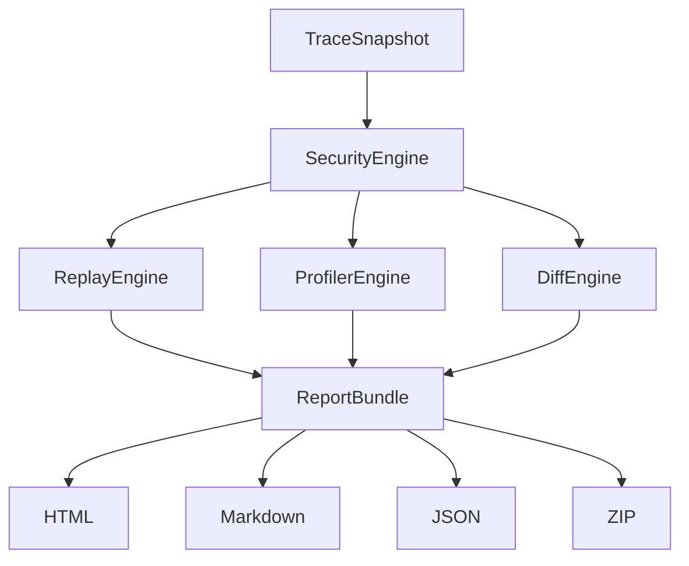
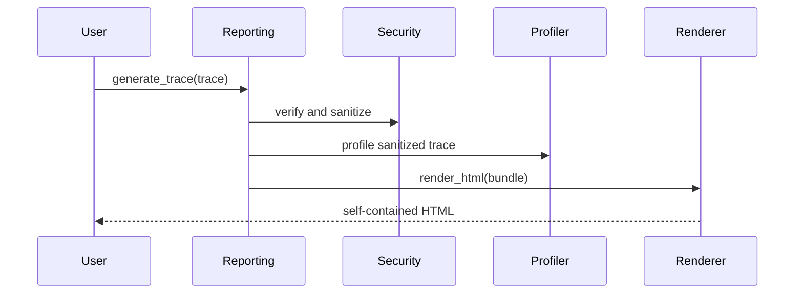

# Reporting Guide

## Overview

`ReportingEngine` creates self-contained offline report bundles and HTML
documents for recorded traces. Reports include overview metrics, execution
graph, timeline, trace tree, search index, filters, profiler data, security
findings, optional diff data, and plugin-provided extensions.

## Concept

Reports are generated from sanitized trace data. The rendered HTML embeds CSS,
JavaScript, and JSON report data in one file.

## Architecture



## Workflow

1. Generate a `ReportBundle` from a trace or run id.
2. Optionally pass `ReportOptions`.
3. Render HTML, JSON, Markdown, or ZIP.
4. Share the output only after security review.

## Mermaid Diagram



## Examples

```python
from agentreplay import ReportOptions, ReportingEngine
from agentreplay.reporting.renderers import render_html

bundle = ReportingEngine().generate_trace(
    trace,
    options=ReportOptions(theme="light", compress=True),
)
html = render_html(bundle)
```

## API

| API | Purpose |
| --- | --- |
| `ReportingEngine.generate(run_id)` | Load from storage and build bundle |
| `ReportingEngine.generate_trace(trace)` | Build bundle from memory |
| `ReportOptions` | Theme, compression, comparison run, visualization limit |
| `ReportBundle` | Report data model |
| `render_html(bundle)` | Self-contained HTML |
| `render_json_bundle(bundle)` | JSON bundle |
| `render_markdown_summary(bundle)` | Markdown summary |
| `render_zip_package(bundle)` | HTML, Markdown, JSON archive |

## CLI

```bash
agentreplay report RUN_ID --output report.html
agentreplay report latest --light --compress --output report.html
agentreplay report RUN1 --compare RUN2 --output comparison.html
```

## Best Practices

- Use `--compress` for shared HTML reports.
- Use `ReportOptions.visualization_limit` for large traces.
- Review security findings before distribution.
- Use diff reports for release candidate comparisons.

## Common Mistakes

- Assuming generated HTML is safe to publish without reviewing trace content.
- Rendering very large traces without visualization limits.
- Expecting report generation to contact external services.

## Performance Notes

Reports include an embedded search index and graph data. Large reports can grow
quickly; compression reduces file size but not generation cost.

## Troubleshooting

If a report is empty, inspect the run first. If a comparison section is absent,
verify that `compare_trace` or `--compare` is supplied.

## References

- [Security Guide](SECURITY_GUIDE.md)
- [Profiler Guide](PROFILER_GUIDE.md)
- [Diff overview in API Reference](api_reference.md)
