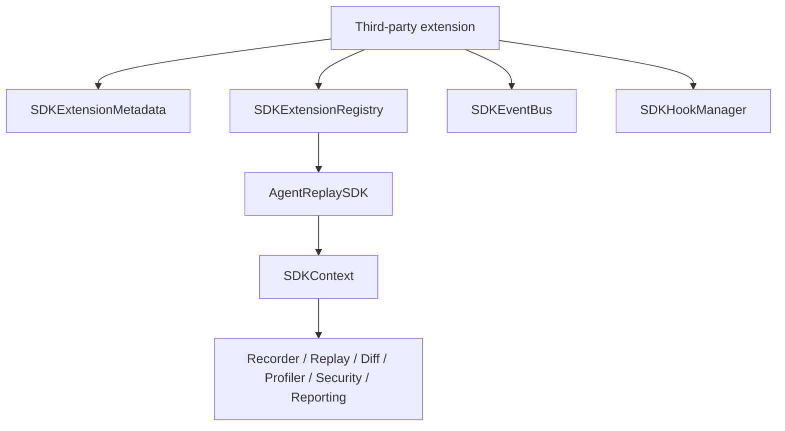
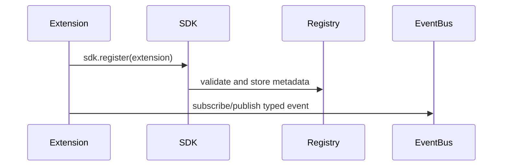

# SDK Guide

## Overview

`agentreplay.sdk` is the stable extension platform for third-party developers.
Future plugins should depend on this package rather than private AgentReplay
modules.

## Concept

The SDK supports analyzers, exporters, storage factories, visualizations,
framework adapters, report extensions, CLI commands, event bus subscriptions,
hooks, metadata, compatibility checks, and deprecation helpers.

## Architecture



## Workflow

1. Create a class with `metadata`.
2. Implement the matching protocol method.
3. Register it with `AgentReplaySDK`.
4. Optionally wrap it as a plugin with SDK plugin helpers.

## Mermaid Diagram



## Examples

```python
from agentreplay.sdk import AnalyzerResult, BaseAnalyzer, analyzer_metadata


class LatencyAnalyzer(BaseAnalyzer):
    metadata = analyzer_metadata("latency")

    def analyze(self, trace):
        return AnalyzerResult(
            analyzer=self.metadata.name,
            metrics={"events": len(trace.events)},
        )
```

```python
from agentreplay.sdk import BaseExporter, ExportResult, exporter_metadata


class JSONLExporter(BaseExporter):
    metadata = exporter_metadata("jsonl")

    def export(self, trace, destination=None):
        return ExportResult(
            exporter=self.metadata.name,
            content_type="application/x-ndjson",
            bytes_written=len(trace.events),
            uri=destination,
        )
```

## API

| API | Purpose |
| --- | --- |
| `AgentReplaySDK` | Main extension facade |
| `SDKContext` | Factories for engines/storage and shared bus/hooks/registry |
| `SDKExtensionMetadata` | Name, version, kind, compatibility, stability |
| `SDKExtensionRegistry` | Register/list/require extensions |
| `SDKEventBus` | Subscribe and publish typed SDK events |
| `SDKHookManager` | Register and emit lifecycle hooks |
| `BaseAnalyzer`, `BaseExporter`, `BaseReportExtension`, `BaseCLICommand` | Convenience base classes |
| `analyzer_plugin`, `exporter_plugin`, `storage_plugin`, `report_plugin`, `cli_plugin` | Bridge SDK extensions to Plugin SDK |

## CLI

SDK CLI extensions register commands through `BaseCLICommand.register`. Loaded
plugin commands are installed by `register_sdk_cli_commands`.

## Event Bus

| Event | Meaning |
| --- | --- |
| `run.started` | A run started |
| `run.finished` | A run finished |
| `event.created` | An event was created |
| `replay.started` | Replay started |
| `replay.finished` | Replay finished |
| `export.started` | Export started |
| `export.finished` | Export finished |
| `profiler.finished` | Profiler completed |
| `regression.finished` | Regression completed |

## Hooks

| Hook | Meaning |
| --- | --- |
| `before_recording`, `after_recording` | Recording lifecycle |
| `before_replay`, `after_replay` | Replay lifecycle |
| `before_export`, `after_export` | Export lifecycle |
| `before_report`, `after_report` | Report lifecycle |
| `before_storage`, `after_storage` | Storage lifecycle |

## Best Practices

- Keep extension payloads JSON-compatible.
- Declare accurate metadata and compatibility.
- Fail gracefully and return structured results.
- Avoid importing private `agentreplay.*` internals unless maintaining core.

## Common Mistakes

- Registering duplicate extension names.
- Declaring a metadata kind that does not match the implemented protocol.
- Performing network calls in analyzers without clear user consent.

## Performance Notes

Analyzers and exporters receive complete traces unless they implement their own
storage-aware streaming. For large traces, expose configuration for limits or
batch sizes.

## Troubleshooting

If registration fails, inspect `metadata.kind`, `metadata.version`, SDK
compatibility, and duplicate names in the registry.

## References

- [Plugin Guide](PLUGIN_GUIDE.md)
- [API Reference](api_reference.md)
- [Best Practices](BEST_PRACTICES.md)
