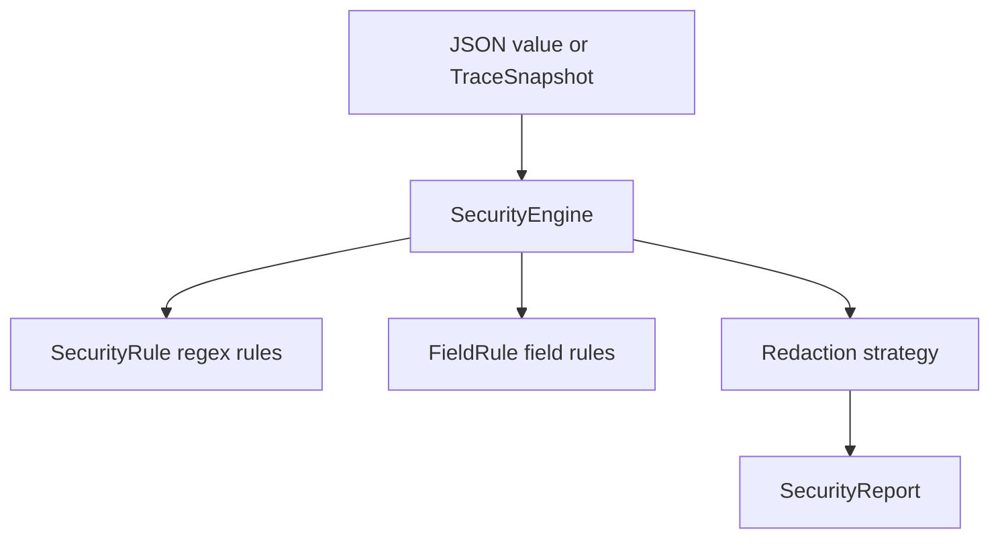
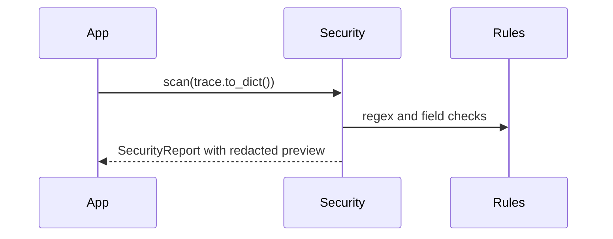

# Security Guide

## Overview

`SecurityEngine` scans JSON-compatible values and traces for secrets and PII.
It can redact with placeholders, masks, partial masks, hashes, removal, or a
custom redactor.

## Concept

Traces can contain prompts, tool outputs, metadata, errors, and credentials.
AgentReplay provides local scanning and redaction so stored and exported traces
are safer to inspect and share.

## Architecture



## Workflow

1. Configure `SecurityConfig`.
2. Call `scan`, `verify`, `sanitize`, `sanitize_event`, or `sanitize_trace`.
3. Review `SecurityReport`.
4. Export safe summaries; raw matched text is not exposed by `to_dict`.

## Mermaid Diagram



## Examples

```python
from agentreplay import SecurityConfig, SecurityEngine, SecurityRule

rule = SecurityRule(
    name="internal_ticket",
    pattern=r"INT-[0-9]{6}",
    category="ticket",
    risk_level="medium",
)

engine = SecurityEngine(SecurityConfig(custom_rules=(rule,)))
report = engine.scan({"prompt": "case INT-123456"})
```

## API

| API | Purpose |
| --- | --- |
| `SecurityEngine.scan(value, source=None)` | Return findings and redacted preview |
| `SecurityEngine.verify(value)` | Scan without preview |
| `SecurityEngine.sanitize(value)` | Return sanitized value |
| `SecurityEngine.sanitize_trace(trace)` | Return sanitized trace |
| `SecurityConfig` | Enabled, PII, strategy, allowlist, denylist, ignore rules |
| `SecurityRule` | Custom regex detection rule |
| `FieldRule` | Field-name based redaction rule |
| `SecurityReport.to_dict()` | JSON-safe report without raw matched text |

## CLI

```bash
agentreplay security scan RUN_ID --verbose
agentreplay security verify exported-run.json
agentreplay security report latest --markdown
agentreplay security rules --json
```

## Best Practices

- Keep redaction enabled by default.
- Use allowlists sparingly.
- Prefer custom regex rules for organization-specific identifiers.
- Review HTML/Markdown/JSON exports before sharing externally.

## Common Mistakes

- Assuming redaction makes every trace safe for public release.
- Allowlisting broad field names such as `prompt`.
- Disabling PII rules in regulated environments.

## Performance Notes

The scanner recursively traverses JSON-compatible values. For huge traces, scan
storage-backed exports or stream event batches when building custom tooling.

## Troubleshooting

If a value is redacted as `sensitive_field`, check field names such as
`authorization`, `token`, `password`, `api_key`, and `secret`.

## References

- [Configuration Guide](CONFIGURATION_GUIDE.md)
- [Reporting Guide](REPORTING_GUIDE.md)
- [Best Practices](BEST_PRACTICES.md)
