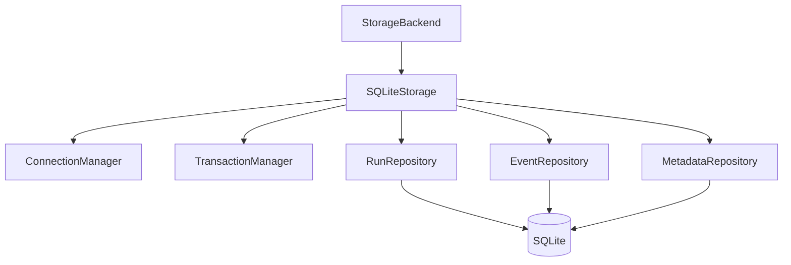
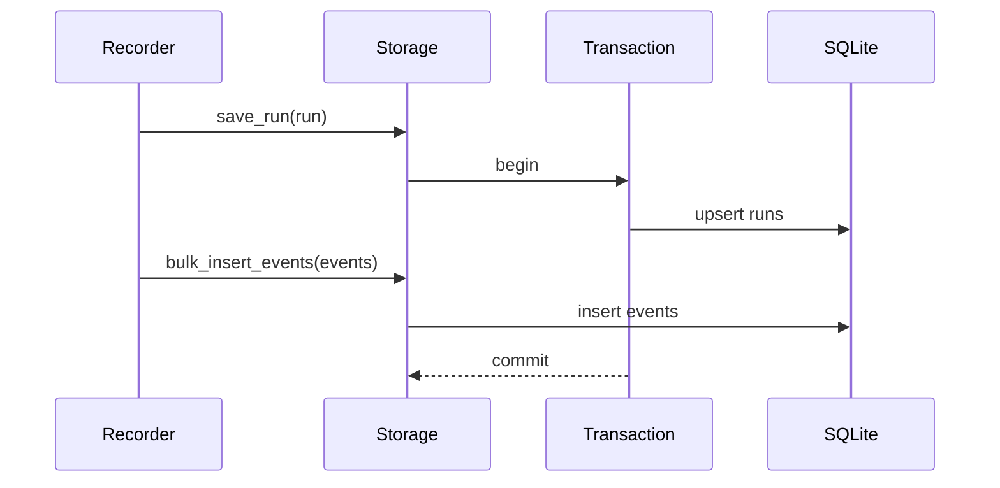

# Storage Guide

## Overview

AgentReplay persists runs through `StorageBackend`. `SQLiteStorage` is the
implemented default backend and supports normalized runs, events, metadata,
attachments, schema versioning, migrations, queries, bulk insert, pagination,
sorting, and streaming event reads.

## Concept

Storage is a boundary: recorders write traces, read-only engines load traces,
and future backends can implement the same protocol.

## Architecture



## Workflow

1. Create a `SQLiteStorage` with an optional path.
2. Save a `RunRecord`.
3. Bulk insert `EventRecord` objects.
4. Query, stream, update, or delete as needed.
5. Close the storage or use it as a context manager.

## Mermaid Diagram



## Examples

```python
from agentreplay import Recorder, SQLiteStorage

with Recorder(name="storage-demo") as recorder:
    recorder.user_prompt("Hello")
    recorder.assistant_response("Hi")

with SQLiteStorage(".agentreplay/agentreplay.sqlite") as storage:
    recorder.save_to_storage(storage)
    run = storage.load_run(recorder.last_run_id())
```

## API

| API | Purpose |
| --- | --- |
| `SQLiteStorage.save_run(run)` | Create or update a run |
| `SQLiteStorage.load_run(run_id)` | Load a run or return `None` |
| `SQLiteStorage.list_runs(...)` | List runs with pagination/filtering |
| `SQLiteStorage.delete_run(run_id)` | Delete a run |
| `SQLiteStorage.save_event(event)` | Save one event |
| `SQLiteStorage.bulk_insert_events(events)` | Insert many events efficiently |
| `SQLiteStorage.load_events(run_id, query=...)` | Load event tuple |
| `SQLiteStorage.stream_events(run_id, batch_size=...)` | Iterate events lazily |
| `EventQuery`, `RunQuery`, `Pagination` | Query controls |

## CLI

```bash
agentreplay list --db-path .agentreplay/agentreplay.sqlite
agentreplay inspect latest --db-path .agentreplay/agentreplay.sqlite
agentreplay analyze-db --db-path .agentreplay/agentreplay.sqlite
agentreplay optimize --db-path .agentreplay/agentreplay.sqlite
agentreplay vacuum --db-path .agentreplay/agentreplay.sqlite
```

## Best Practices

- Use bulk inserts for completed traces.
- Use streaming reads for large traces.
- Keep `.agentreplay/` out of version control.
- Treat SQLite files as sensitive if traces include prompts or outputs.

## Common Mistakes

- Opening multiple storages and forgetting to close them.
- Loading huge traces when a windowed or streaming API is enough.
- Assuming non-SQLite backends are implemented; they are extension targets.

## Performance Notes

Indexes exist for run id, timestamp, event type, and parent event relationships.
Use `SQLiteOptimizer` and `agentreplay optimize` for local database maintenance.

## Troubleshooting

If a run cannot be found, confirm the database path and list stored runs before
running replay, diff, debugger, or reporting commands.

## References

- [Performance Guide](PERFORMANCE_GUIDE.md)
- [CLI Reference](CLI_REFERENCE.md)
- [Architecture](architecture.md)
