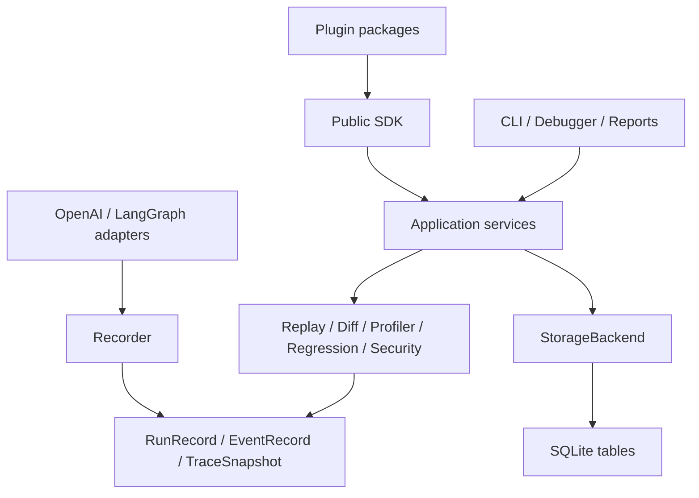
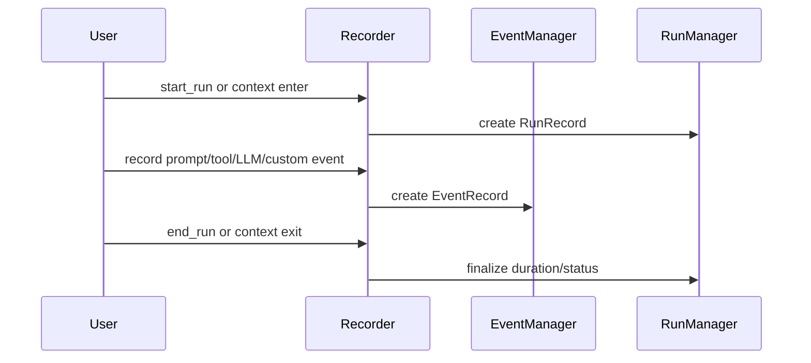
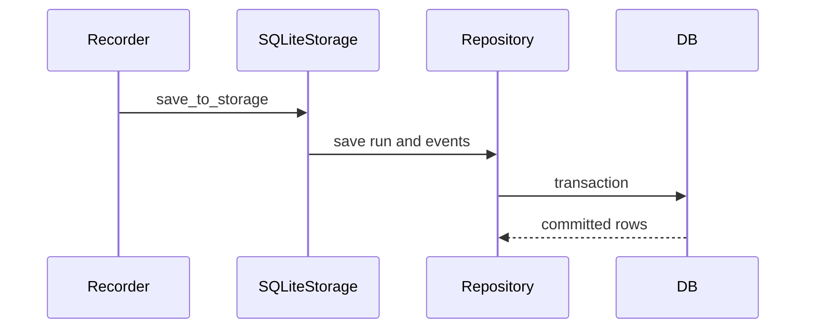
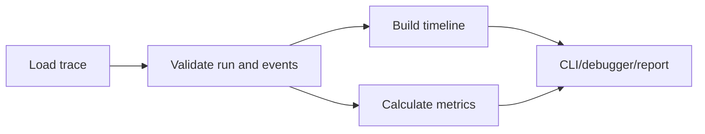
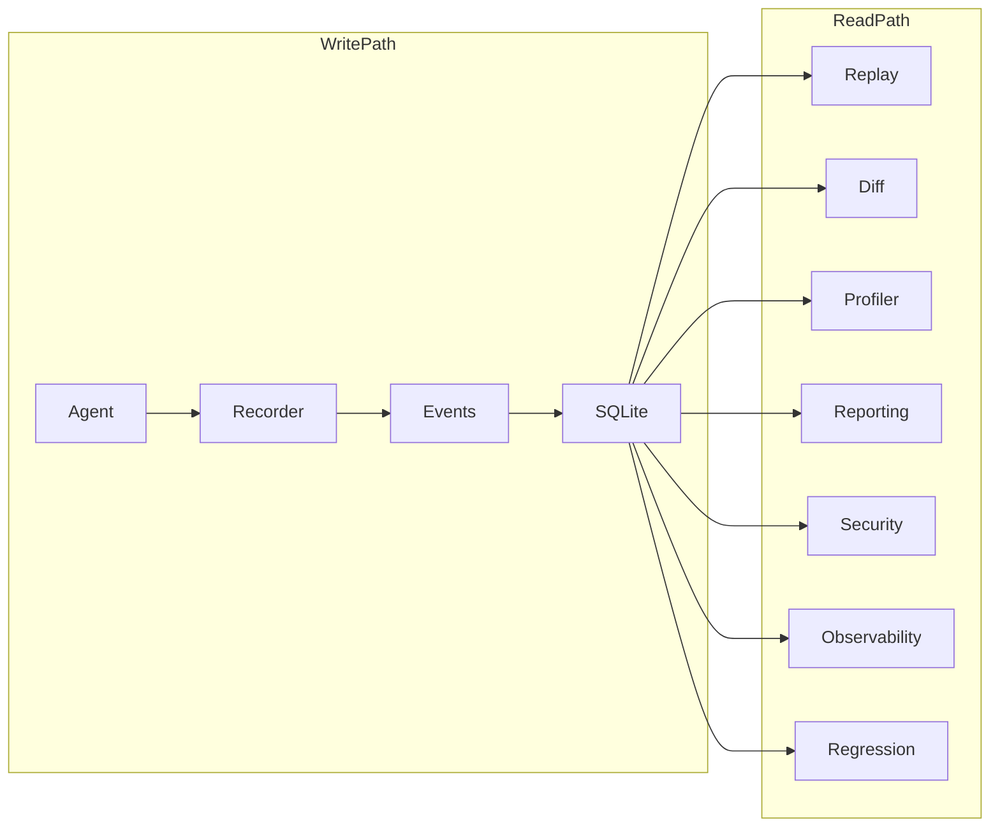

# System Design

## Overview

AgentReplay is a local-first trace system. It captures agent execution as
structured events, stores them through an abstract backend, and exposes multiple
read-only consumers. The design keeps capture logic separate from framework
adapters and keeps extension authors on the public SDK.

## Concept

The system optimizes for:

- deterministic offline debugging
- minimal runtime dependencies
- typed data contracts
- future storage and framework extensibility
- safe handling of sensitive trace data
- maintainable open-source contribution boundaries

## Architecture



## Workflow

### Recording



### Persistence



### Analysis



## Mermaid Diagram



## Examples

Storage-backed analysis:

```python
from agentreplay import ProfilerEngine, SQLiteStorage

with SQLiteStorage(".agentreplay/agentreplay.sqlite") as storage:
    report = ProfilerEngine(storage=storage).profile("run-id")
    print(report.summary())
```

## API

The main system contracts are:

- `TraceSnapshot`: complete in-memory trace
- `StorageBackend`: persistence protocol
- `Recorder`: trace producer
- `ReplayEngine`, `DiffEngine`, `ProfilerEngine`, `RegressionEngine`: read-only
  analysis services
- `ReportingEngine`: report bundle producer
- `SecurityEngine`: scanner and redactor
- `ObservabilityEngine`: OpenTelemetry-compatible mapper/exporter
- `SDKContext`: extension-safe factory and registry context

## CLI

Commands mirror the service boundaries:

| Command | Service |
| --- | --- |
| `record` | manual recording command surface |
| `list`, `inspect` | storage-backed run lookup |
| `replay`, `debug` | replay/debugger |
| `diff`, `regression` | comparison engines |
| `profile`, `report` | profiler/reporting |
| `security` | security engine |
| `telemetry` | observability engine |
| `benchmark`, `optimize`, `analyze-db`, `vacuum` | performance tools |

## Best Practices

- Prefer constructor injection for storage and custom engines.
- Keep adapters thin and delegate to `Recorder`.
- Use immutable model objects at module boundaries.
- Use CLI commands as wrappers over public engines, not separate business logic.

## Common Mistakes

- Sharing mutable payload dictionaries after creating `EventRecord`.
- Assuming plugin registration is global without loading a plugin manager.
- Writing extension code against private packages instead of SDK protocols.

## Performance Notes

SQLite operations support bulk insert and streaming reads. Large visualizations
should respect `ReportOptions.visualization_limit`. Performance-sensitive tests
are marked `performance` and run separately from coverage.

## Troubleshooting

Use `agentreplay inspect latest --json` to confirm storage content, then use
`agentreplay replay RUN_ID --timeline` to verify the timeline before debugging
profiler, reporting, or regression output.

## References

- [Architecture](architecture.md)
- [CLI Reference](CLI_REFERENCE.md)
- [Performance Guide](PERFORMANCE_GUIDE.md)
- [Troubleshooting](TROUBLESHOOTING.md)
