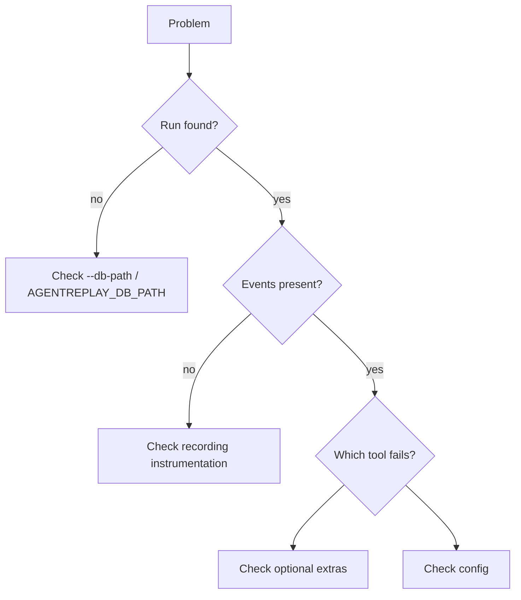
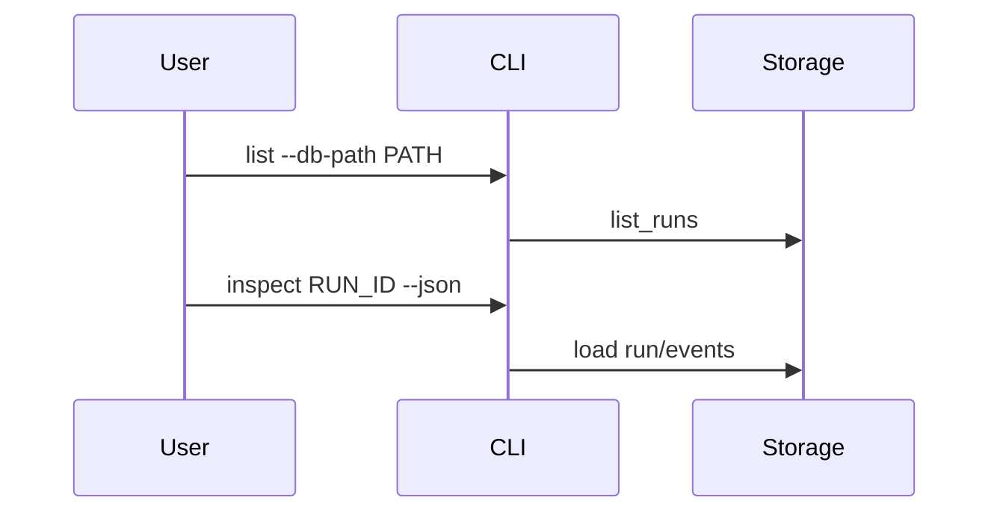

# Troubleshooting

## Overview

This guide maps common symptoms to checks grounded in the current
implementation.

## Concept

Most issues fall into one of four groups: storage path, optional dependency,
configuration, or trace content.

## Architecture



## Workflow

1. Run `agentreplay list`.
2. Inspect a run as JSON.
3. Replay the timeline.
4. Try the specialized command.
5. Check optional extras and config.

## Mermaid Diagram



## Examples

```bash
agentreplay list --db-path .agentreplay/agentreplay.sqlite
agentreplay inspect latest --json
agentreplay replay latest --timeline
```

## API

Use `SQLiteStorage.load_run(run_id)` and `SQLiteStorage.load_events(run_id)` in
small diagnostic scripts to verify storage directly.

## CLI

| Symptom | Command |
| --- | --- |
| Cannot find run | `agentreplay list --db-path PATH` |
| Replay output is empty | `agentreplay inspect RUN_ID --json` |
| Debugger import fails | `pip install "agentreplay[debugger]"` |
| OTLP export fails | `pip install "agentreplay[otel]"` |
| Adapter unavailable | Install `openai-agents` or `langgraph` extra |
| Plugin missing | `agentreplay plugins list` |

## Best Practices

- Keep a minimal reproduction trace.
- Use JSON output for issue reports.
- Include Python version and AgentReplay version.
- Avoid sharing raw secrets in issue descriptions.

## Common Mistakes

- Looking at the default database while writing to a custom path.
- Running performance tests under coverage and comparing timings.
- Expecting future framework extension targets to be full adapters.

## Performance Notes

For slow commands, check event count. Use `analyze-db`, `optimize`, windowed
replay, and streaming export for large traces.

## Troubleshooting

If a report, replay, or diff fails only for one run, export that run as JSON and
try loading from file to separate storage issues from trace-shape issues.

## References

- [CLI Reference](CLI_REFERENCE.md)
- [Configuration Guide](CONFIGURATION_GUIDE.md)
- [Storage Guide](STORAGE_GUIDE.md)
