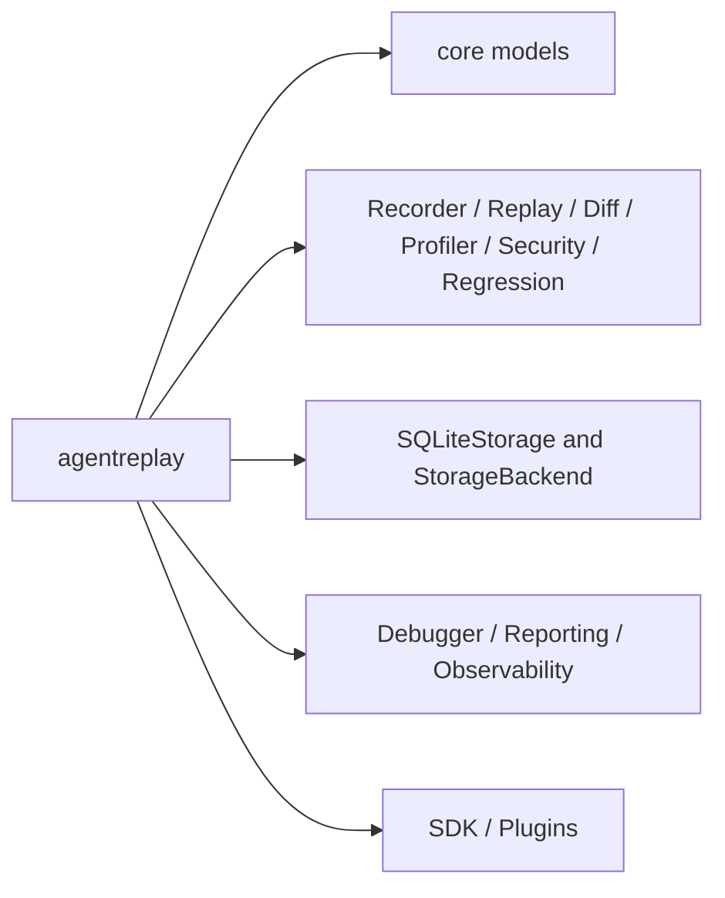
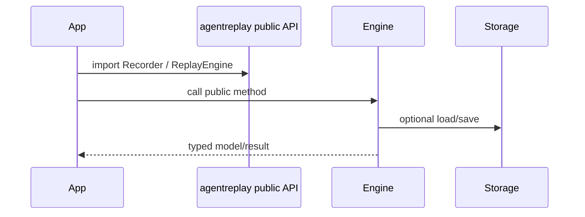

# API Reference

## Overview

This page lists the public API surfaces exported by the implementation. It is
based on `agentreplay.__init__` and package `__all__` declarations.

## Concept

Application code should import from `agentreplay` for common workflows and from
`agentreplay.sdk` for extensions. Internal packages are documented for
maintainers but are not the recommended third-party dependency surface.

## Architecture



## Workflow

1. Create or load a `TraceSnapshot`.
2. Pass the trace or run id to a public engine.
3. Render, export, or inspect the result.
4. For extensions, register typed SDK objects with `AgentReplaySDK`.

## Mermaid Diagram



## Examples

```python
from agentreplay import Recorder, ReplayEngine, SQLiteStorage

with Recorder(name="api-demo") as recorder:
    recorder.user_prompt("Hello")
    recorder.assistant_response("Hi")

with SQLiteStorage(".agentreplay/agentreplay.sqlite") as storage:
    recorder.save_to_storage(storage)
    session = ReplayEngine(storage=storage).load(recorder.last_run_id())
```

## API

| Import | Purpose |
| --- | --- |
| `Recorder`, `record` | Record execution events |
| `SQLiteStorage`, `StorageBackend` | Persist and load traces |
| `ReplayEngine` | Reconstruct timelines read-only |
| `DiffEngine` | Compare two traces or run ids |
| `DebuggerEngine`, `DebuggerSession` | Load interactive debugger sessions |
| `ProfilerEngine`, `ProfilingReport` | Analyze latency, tokens, cost, tools, models, memory |
| `ReportingEngine`, `ReportOptions`, `ReportBundle` | Build standalone report bundles |
| `SecurityEngine`, `SecurityConfig`, `SecurityRule` | Scan and redact secrets/PII |
| `ObservabilityEngine`, `ObservabilityConfig` | Map traces to telemetry |
| `RegressionEngine`, `RegressionReport` | Compare baseline and target behavior |
| `AgentReplaySDK`, `SDKContext`, `create_sdk` | Build extensions |
| `AgentReplayPlugin`, `PluginManager`, `PluginApp` | Load plugin packages |

::: agentreplay

::: agentreplay.sdk

::: agentreplay.recording

::: agentreplay.storage

::: agentreplay.replay

::: agentreplay.diff

::: agentreplay.debugger

::: agentreplay.profiler

::: agentreplay.reporting

::: agentreplay.security

::: agentreplay.observability

::: agentreplay.performance

::: agentreplay.regression

## CLI

See [CLI Reference](CLI_REFERENCE.md).

## Best Practices

- Use top-level imports for application code.
- Use `agentreplay.sdk` for plugin and extension packages.
- Pass storage explicitly in production tools.
- Treat analysis result objects as immutable reports.

## Common Mistakes

- Depending on private helper functions.
- Expecting optional integrations to exist without installing extras.
- Passing non-JSON-compatible payloads directly to models; use recorder
  serialization APIs for arbitrary objects.

## Performance Notes

For large traces, prefer storage streaming APIs and performance utilities rather
than fully materializing exports.

## Troubleshooting

If an import fails, check whether it belongs to an optional extra. If a
mkdocstrings block fails locally, install `agentreplay[docs]`.

## References

- [Architecture](architecture.md)
- [SDK Guide](SDK_GUIDE.md)
- [Plugin Guide](PLUGIN_GUIDE.md)
