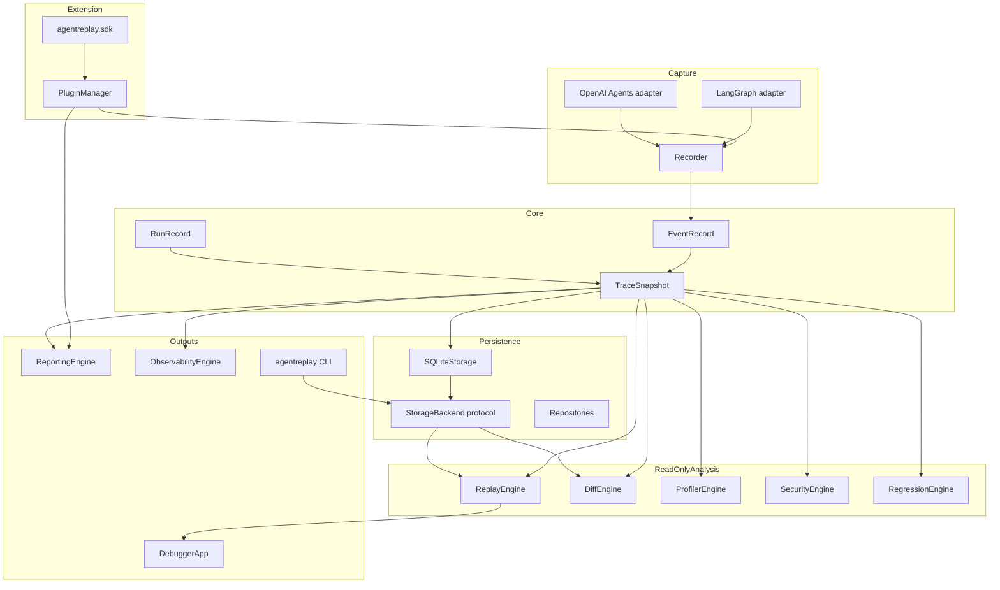
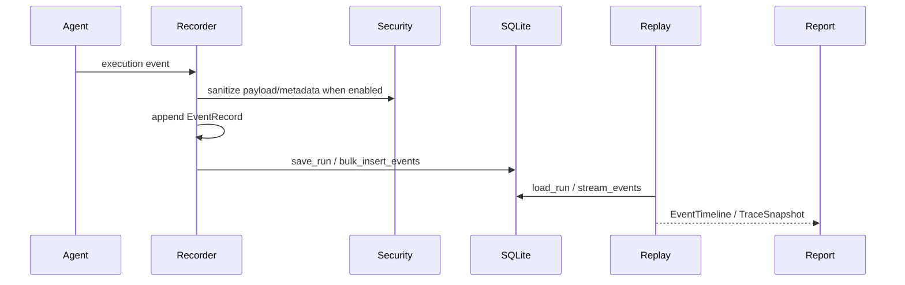

# Architecture

## Overview

AgentReplay is built as a framework-agnostic core with optional adapters,
storage, analysis engines, a CLI, a plugin system, and a stable public SDK.
The implementation favors immutable domain models, typed protocols, local
storage, and read-only analysis.

Related guides: [System Design](SYSTEM_DESIGN.md), [API Reference](api_reference.md),
[SDK Guide](SDK_GUIDE.md), [Storage Guide](STORAGE_GUIDE.md).

## Concept

The central object is a `TraceSnapshot`: one `RunRecord` plus ordered
`EventRecord` objects. Everything else either creates, persists, reads, maps, or
renders that snapshot.

| Layer | Packages | Responsibility |
| --- | --- | --- |
| Domain | `agentreplay.core` | Event, run, trace, ID, clock, metadata primitives |
| Capture | `agentreplay.recording`, `agentreplay.adapters` | Observe agent execution and create event records |
| Persistence | `agentreplay.storage` | Store and stream runs/events through SQLite |
| Analysis | `replay`, `diff`, `profiler`, `regression`, `security` | Read traces and derive views or findings |
| Experience | `debugger`, `reporting`, `cli` | Terminal, report, and command surfaces |
| Extension | `plugins`, `sdk` | Third-party extension discovery and stable APIs |
| Operations | `performance`, `observability`, CI | Large-trace tools and telemetry mapping |

## Architecture



## Workflow

1. A recorder or adapter observes execution.
2. The recorder creates immutable `EventRecord` objects with timestamp,
   duration, payload, metadata, run id, and optional parent event id.
3. A `TraceSnapshot` can stay in memory or be saved to `SQLiteStorage`.
4. Offline engines load or receive a trace and produce deterministic results.
5. CLI, debugger, and reports render those results for humans.
6. Plugins and SDK extensions add capabilities without changing core code.

## Mermaid Diagram



## Examples

```python
from agentreplay import Recorder, SQLiteStorage

with Recorder(name="architecture-demo") as recorder:
    recorder.user_prompt("Hello")
    recorder.assistant_response("Hi")

with SQLiteStorage(".agentreplay/agentreplay.sqlite") as storage:
    recorder.save_to_storage(storage)
```

## API

Primary public imports are exported from `agentreplay.__init__`:

- `Recorder`, `record`
- `SQLiteStorage`, `StorageBackend`, `EventQuery`, `RunQuery`, `Pagination`
- `ReplayEngine`, `DiffEngine`, `ProfilerEngine`, `RegressionEngine`
- `SecurityEngine`, `ObservabilityEngine`, `ReportingEngine`, `DebuggerEngine`
- `AgentReplaySDK`, `create_sdk`, `AgentReplayPlugin`, `PluginManager`

## CLI

All CLI commands are registered in `agentreplay.cli.main.build_parser`.
Use [CLI Reference](CLI_REFERENCE.md) for options and examples.

## Best Practices

- Treat `TraceSnapshot` as the boundary between capture and analysis.
- Keep framework integrations optional and observational.
- Depend on `agentreplay.sdk` for third-party extensions.
- Keep replay, diff, debugger, profiler, reporting, and regression read-only.
- Store secrets defensively; recorded traces can contain sensitive payloads.

## Common Mistakes

- Importing internal modules from plugins instead of `agentreplay.sdk`.
- Assuming replay re-executes tools or LLM calls; it does not.
- Adding required dependencies for optional framework integrations.
- Mutating stored run data from analysis code.

## Performance Notes

Replay and diff can operate on in-memory traces or storage-backed runs. For
large traces, prefer storage streaming, `TraceWindowReader`,
`StreamingTraceExporter`, and benchmark helpers from `agentreplay.performance`.

## Troubleshooting

| Symptom | Check |
| --- | --- |
| Missing run | Verify `AGENTREPLAY_DB_PATH` or `--db-path` |
| Optional adapter import error | Install the matching extra |
| Empty report | Confirm the run has events |
| Plugin not loaded | Check plugin name, metadata validation, disabled plugin config |

## References

- [System Design](SYSTEM_DESIGN.md)
- [Storage Guide](STORAGE_GUIDE.md)
- [SDK Guide](SDK_GUIDE.md)
- [Plugin Guide](PLUGIN_GUIDE.md)
- [Performance Guide](PERFORMANCE_GUIDE.md)
