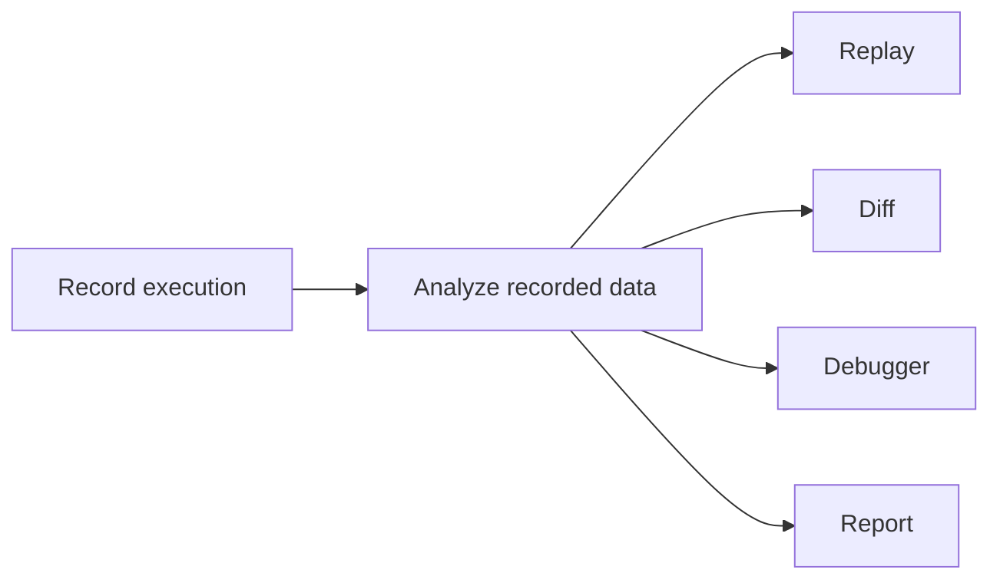
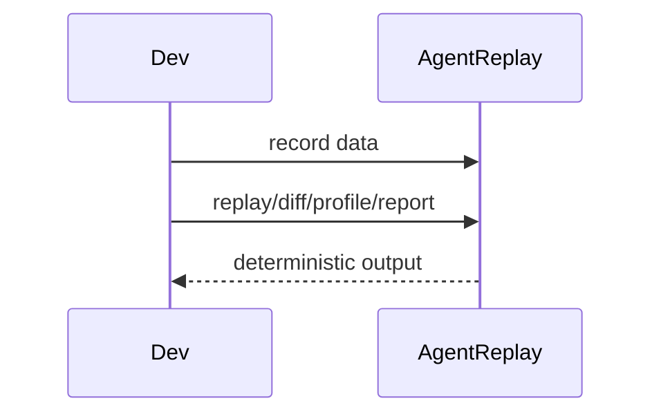

# FAQ

## Overview

Frequently asked questions about AgentReplay behavior, dependencies, and
extension points.

## Concept

AgentReplay is an observer and offline analyzer. It is not an agent framework,
LLM provider, or remote tracing service.

## Architecture



## Workflow

Install the base package, record a trace, save it if needed, then use CLI or
Python engines to inspect it.

## Mermaid Diagram



## Examples

```bash
pip install agentreplay
agentreplay --help
```

## API

See [API Reference](api_reference.md).

## CLI

See [CLI Reference](CLI_REFERENCE.md).

## Questions

| Question | Answer |
| --- | --- |
| Does replay call my LLM? | No. Replay reads recorded events only. |
| Does diff execute tools? | No. Diff compares recorded data only. |
| Is an API key required? | No. AgentReplay itself requires no API key. |
| What storage backend is implemented? | SQLite. Other backends are extension targets. |
| Which adapters are first class? | OpenAI Agents SDK and LangGraph. |
| Are other framework adapters complete? | Placeholder modules exist for future/plugin support. |
| Does the base install include Textual or OpenTelemetry? | No. Use optional extras. |
| Is the API stable? | It is typed and documented but pre-1.0. |

## Best Practices

- Install only the extras you need.
- Keep traces private unless redacted and reviewed.
- Use the SDK for extension packages.

## Common Mistakes

- Treating AgentReplay as a live observability backend.
- Expecting adapters to record data if their optional frameworks are not
  installed.

## Performance Notes

Use windowing and streaming helpers for large traces.

## Troubleshooting

Start with [Troubleshooting](TROUBLESHOOTING.md) and include command output when
filing an issue.

## References

- [Architecture](architecture.md)
- [Best Practices](BEST_PRACTICES.md)
