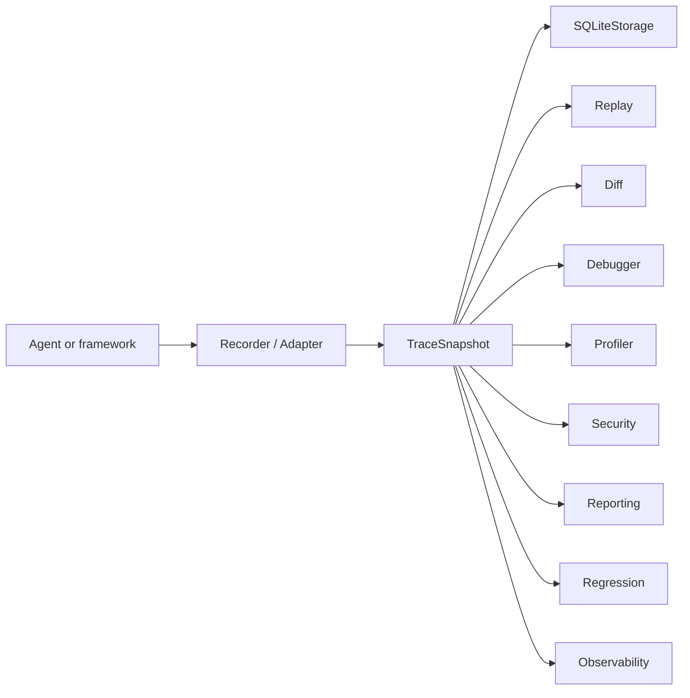
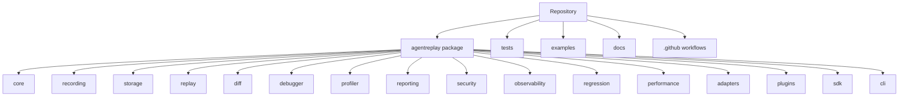

# AgentReplay Documentation

AgentReplay is a local debugging, replay, and observability platform for AI
agent executions. It records execution events, stores them locally by default,
and provides read-only analysis tools for replay, diffing, profiling,
debugging, security scanning, reporting, telemetry mapping, and regression
detection.

## Start Here

| Goal | Read |
| --- | --- |
| Understand the system | [Architecture](architecture.md) and [System Design](SYSTEM_DESIGN.md) |
| Install and try the library | [Tutorials](tutorials.md) and [Examples](examples.md) |
| Use the Python API | [API Reference](api_reference.md) |
| Use the terminal | [CLI Reference](CLI_REFERENCE.md) |
| Configure AgentReplay | [Configuration Guide](CONFIGURATION_GUIDE.md) |
| Build extensions | [SDK Guide](SDK_GUIDE.md) and [Plugin Guide](PLUGIN_GUIDE.md) |
| Operate safely | [Security Guide](SECURITY_GUIDE.md) and [Best Practices](BEST_PRACTICES.md) |
| Fix problems | [Troubleshooting](TROUBLESHOOTING.md) and [FAQ](faq.md) |

## Mental Model



AgentReplay analysis is intentionally read-only. After a trace is recorded,
replay, diff, debugging, profiling, reporting, security scanning, telemetry
mapping, and regression analysis do not call LLMs or execute tools.

## Core Guarantees

- The base package has no runtime dependencies.
- No API key is required by AgentReplay itself.
- SQLite is the implemented default persistence backend.
- Framework integrations are optional extras.
- OpenAI Agents SDK and LangGraph have first-class adapters.
- External extensions should depend on `agentreplay.sdk` rather than internal
  modules.

## Repository Map



## Documentation Sets

### Concepts and Architecture

- [Architecture](architecture.md)
- [System Design](SYSTEM_DESIGN.md)
- [Storage Guide](STORAGE_GUIDE.md)
- [Observability Guide](OBSERVABILITY_GUIDE.md)

### User Guides

- [Debugger Guide](DEBUGGER_GUIDE.md)
- [Profiler Guide](PROFILER_GUIDE.md)
- [Reporting Guide](REPORTING_GUIDE.md)
- [Regression Guide](REGRESSION_GUIDE.md)
- [Security Guide](SECURITY_GUIDE.md)
- [Performance Guide](PERFORMANCE_GUIDE.md)

### Extension Guides

- [SDK Guide](SDK_GUIDE.md)
- [Plugin Guide](PLUGIN_GUIDE.md)
- [OpenAI Agents SDK](openai_agents.md)
- [LangGraph](langgraph.md)

### Reference

- [API Reference](api_reference.md)
- [CLI Reference](CLI_REFERENCE.md)
- [Configuration Guide](CONFIGURATION_GUIDE.md)
- [Release Engineering](release_engineering.md)

### Operations

- [Best Practices](BEST_PRACTICES.md)
- [Troubleshooting](TROUBLESHOOTING.md)
- [FAQ](faq.md)
- [Development](development.md)
- [Migration](migration.md)

## Installation

```bash
pip install agentreplay
```

Optional extras:

```bash
pip install "agentreplay[debugger]"
pip install "agentreplay[otel]"
pip install "agentreplay[openai-agents]"
pip install "agentreplay[langgraph]"
pip install "agentreplay[all]"
```

## Quick Example

```python
from agentreplay import Recorder, ReplayEngine, SQLiteStorage

with Recorder(name="demo") as recorder:
    recorder.user_prompt("Hello")
    recorder.assistant_response("Hi")

with SQLiteStorage(".agentreplay/agentreplay.sqlite") as storage:
    recorder.save_to_storage(storage)
    run_id = recorder.last_run_id()
    session = ReplayEngine(storage=storage).load(run_id)

print(session.timeline.render())
```

## Release Quality

The repository includes Ruff, MyPy, pytest, coverage, pre-commit, Bandit,
pip-audit, Vulture, MkDocs Material, build validation, semantic-release
configuration, GitHub Actions for Linux/macOS/Windows, and benchmark automation.
